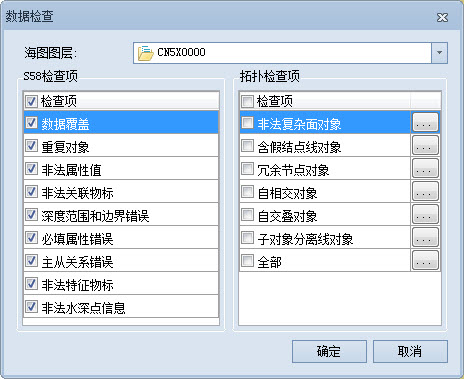
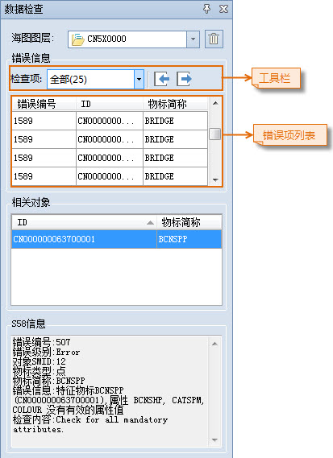
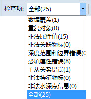

### 使用说明

S-58 标准，即 ENC 数据有效性检验标准，是由国际海道测量组织（IHO）制定并颁布的。S-58 标准共包括五部分：ENC 数据结构检查、ENC 产品规范检查、ECDIS 相关检查、ENC 物标类目使用检查和特殊物标类属性检查。S-58 标准是检验 ENC 数据是否兼容于 S-57 标准和 ENC 产品规范的国际标准，通过 S-58 检查可以保证在交换传递过程中维护数据的一致性。

SuperMap 海图模块提供的 S-58 检查依据 IHO 于 2011 年颁布的 4.2 版本的 S-58 标准对海图数据进行验核。除 S-58 检查外，还可以进行其他必要的检查。从新生产一幅海图数据或对已有海图数据进行改正时，在编辑过程中，无法也不可能对所有操作进行实时的检查，因此，在对海图数据进行编辑后，必须进行数据检查，并依据错误信息修改直至无误，以保障海图数据能够依据国际标准进行数据格式交换与传输，并且最大程度的减少因为数据错误而影响航行的安全。

需要注意，在进行海图数据检查之前，必须保证已经创建好了链节点拓扑关系。如果是对数据进行了修改，需要重新构建拓扑关系。

SuperMap 提供的海图数据检查目前包含以下方面。这些检查既包含 S-58 检查，也包括一部分 SuperMap 认为必要而定义的检查。

### 操作步骤

1. 在海图数据编辑模式下，将可编辑海图分组在地图窗口中打开，在“地图”选项卡的“数据管理”组中，单击“数据检查”下拉按钮，选择“数据检查”，弹出“数据检查”对话框。  
  
2. 在“S58检查项”和“拓扑检查项”中勾选需检查的内容，默认勾选了 S58 标准检查项的所有选项。   
**标准检查项** ：
   * 数据覆盖：检查特征物标对象和元物标对象覆盖范围是否一致。
   * 重复对象：检查同一种特征物标类型，是否存在属性和几何对象都相同的重复对象，除水深点外。
   * 非法属性值：检查特征物标属性值是否有效。
   * 非法关联物标：检查所有的集合特征物标是否包含两个及以上的特征物标对象。
   * 主从关系错误：检查所有的被主物标引用的从属物标和所有主从物标之间的关系是否都正确。
   * 深度范围和水深线错误：检查如果DEPCNT（VALDCO）与面类的DEPARE共线，且没有线状DEPARE，属性值是否为:最大的DRVAL2 > VALDCO > 最小的DRVAL1，且最小的DRVAL2 = VALDCO >= 最小的DRVAL1。
   * 必填属性错误：检查所有的必填属性是否为非空。
   * 非法特征物标：检查特征物标与空间几何对象关系是否非法。
   * 水深检查：检查是否存在重复水深点；检查水深组内的水深点是否有相同的空间属性和特征物标属性；检查所有相同分组的水深点，FOID、特征物标RCID、空间物标RCID、属性是否都相同。  
**SuperMap 自定义检查项** ：  
   * 非法复杂面对象：检查所有的面状特征物标对象是否含有多个岛部分。
   * 含假结点线对象：检查线对象是否存在假结点。
   * 冗余节点对象：检查线对象是否存在冗余节点。
   * 自相交对象：检查面和线特征物标对象是否存在没有边界和空间线对象自相交。
   * 自交叠对象：检查同一类面特征物标对象没有交叠。
   * 子对象分离线对象：检查所有的线状特征物标对象节点是否连续。
3. 若用户勾选 SuperMap 自定义检查项，可单击“**...**”按钮，在“物标选择”对话框左侧选择需要进行该项检查的物标，单击“添加”按钮即可。
4. 单击“数据检查”对话框中的“确定”按钮，在弹出的“数据检查”面板中，会显示相关的错误信息，包括错误信息列表、错误相关对象、S58 信息等内容。 
   * 错误信息列表：可按检查项显示错误信息，也可显示全部，每项错误都有列举错误编号、物标ID、物标简称。选中一项错误信息时，对应的物标会在地图窗口中高亮并居中显示。
   * 相关对象：每条错误信息会有一个或多个相关对象，此处列举对应错误项的相关对象。
   * S58信息：根据 S58 数据标准显示选中错误项的错误编号、错误级别、错误信息、检查内容等信息。  
  
5. 在工具栏处单击“检查项”右侧下拉按钮，用户可根据需求选择显示检查项错误信息。  
  
6. **导出错误信息** ：可将当前可编辑海图分组的数据检查错误信息导出为 *.xml 文件，单击工具栏处的“导出”按钮，弹出“数据检查结果导出”对话框。参数设置说明如下：
   * 在对话框中单击“检查项”下拉按钮，选择需导出数据检查项的结果。
   * 在“保存路径”处，设置导出 *.xml 文件保存路径和保存名称。
   * 勾选“进行追加导出”复选框，可将数据检查信息追加导出至已有的 *.xml 文件中。
7. **导入错误信息** ：可将数据检查数据信息文件导入到当前打开的可编辑分组中。单击工具栏处的“导入”按钮，弹出“数据检查结果导入”对话框，在对话框的“导入文件”处选择导入文件的，单击“确定”按钮，即可导入数据检查的错误信息。 
8. 根据 S58 信息中的错误提示信息，对数据进行修改，直到再进行数据检查无错误，才可海图数据能够依据国际标准进行数据格式交换与传输。