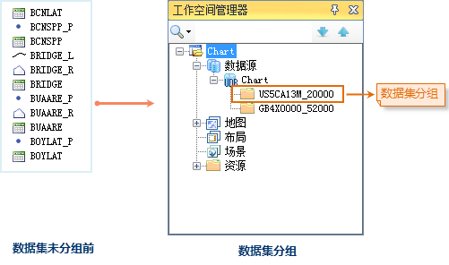

为了便于对海图数据集进行统一的管理，引入数据集分组的概念。数据集分组主要为管理数据源中的数据集构建的一种逻辑化的组织结构形式。这种数据组织形式的优点是数据组织层次清晰明了，可读性好，方便用户统一管理海图数据。

一幅海图往往会包含几十个甚至上百个数据集，如左图所示，而对于海图用户，关注的是整幅海图的展现，而不是单个数据集。SuperMap 应用程序在导入海图数据后，将同一幅海图的数据集存储在一个数据集分组中，不再显示海图所包含的每一个数据集。在同一个数据源下，可以存在多个分组，即可以在一个数据源下组织多幅海图数据。对分组后的海图数据，可以进行打开、导出和删除分组等操作。

 
  
###  注意事项

要查看数据集分组中的海图数据，必须先通过工作空间中的数据集分组打开海图。
