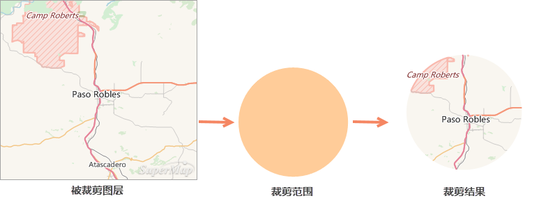
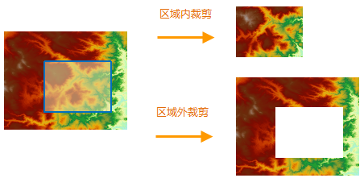
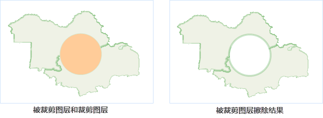
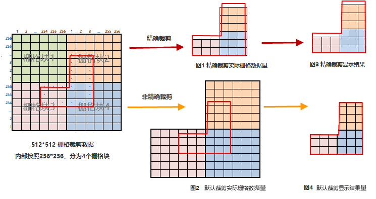

用户在进行地理数据处理与分析时，可能只需要对地图中的某一块区域进行研究，此时，可以通过 **地图裁剪**
功能提取该区域的地图或数据。裁剪之后还可减小数据量，提高数据处理的效率。

当地图窗口中存在一个或者多个图层时，可通过绘制矩形、圆形、多边形或者选中某一图层中的面对象对被裁剪图层进行裁剪操作。裁剪结果可以保存输出为一个新的数据集。被裁剪图层可以为点、线、面、CAD
图层、文本图层或者栅格图层；裁剪图层或裁剪区域需为面图层。裁剪结果的类型最终和被裁剪图层保持一致。

  

* **裁剪方式**

在进行地图裁剪时，可以对裁剪的方式进行设置，包括区域外、区域内两种方式：

* **区域内** ：裁剪区域范围内的地图将被保留输出
* **区域外** ：裁剪区域范围外的地图将被保留并输出  

  

* **擦除裁剪区域**

对被裁剪图层进行擦除裁剪区域的操作。操作后被裁剪图层的裁剪区域部分数据将被擦除。目前只能对矢量格式的地图数据进行擦除裁剪区域的操作，栅格地图不支持擦除操作。

如下图所示：黄色区域为被裁剪图层，蓝色区域为裁剪图层，选中圆形区域对黄色多边形进行地图裁剪，裁剪方式为区域内，地图裁剪完成后，对被裁剪图层的擦除结果如下所示：

  

* **精确裁剪**

裁剪栅格或影像数据时，可在精确裁剪下拉框中选择是否进行精确裁剪。

精确裁剪与默认裁剪的区别在于（以区域内裁剪为例）：

**1、得到裁剪结果的栅格数据量不同，区别主要是裁剪区域边界数据的处理:**

* **精确裁剪** ：裁剪区域边界处的数据处理单元是像元，若裁剪区域压盖的像元的中心点，则保留该像元。反之不保留。如下图1所示，保留了中心点位于裁剪区域内的像元，舍弃了中心点位于裁剪区以外的像元，得到最终的实际存储数据，数据量较小。
* **默认裁剪** ：裁剪区域边界处的数据处理单元是栅格块，若裁剪区域与栅格块相交，则保留整个栅格块。如下图2所示，若栅格块大小是256*256，裁剪区域与栅格块2、栅格块3、栅格块4相交，则三个栅格块全部保留，得到最终的实际存储数据，数据量较大。
  
---  

**2、显示效果不同，产生的原因是得到裁剪结果的栅格数据量不同**

显示效果是对裁剪得到的实际存储数据按照裁剪区域进行显示。

* **精确裁剪** ：由于结果数据裁剪边界像元的取舍，显示结果会出现保留部分不满一个像元和舍弃部分少量空白的情况，如上图3所示。
* **默认裁剪** ：由于结果数据保留了与边界相交的整个栅格块，显示结果严格按照裁剪区域进行显示，如上图4所示。

**3、裁剪效率不同**

默认裁剪边界区域的处理单元是栅格块，精确裁剪边界区域的处理单元是像元，因此默认裁剪效率比精确裁剪效率高，当裁剪较大数据并且只关注显示效果时，优先选择默认裁剪。
当需要比较精确的实际存储数据时，采用精确裁剪。

###  相关主题

 [地图裁剪](RecanlgeClip)

