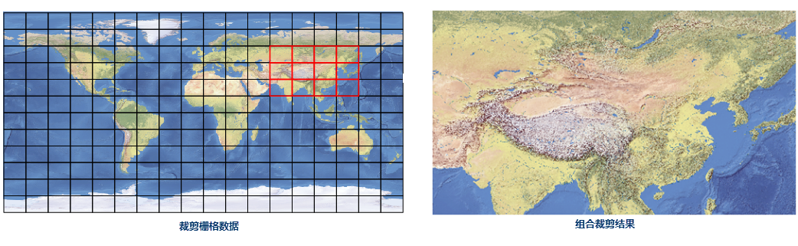
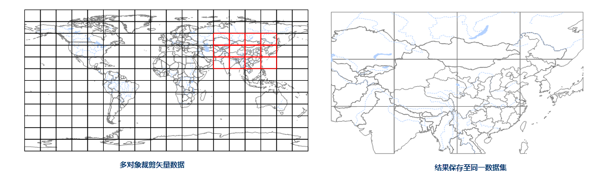

通过指定的裁剪范围对地图窗口中的指定图层进行区域裁剪。目前支持以绘制矩形、圆形、多边形和选中对象的方式，指定裁剪范围进行地图裁剪操作。

###  功能入口

**地图** 选项卡-> **操作** -> **地图裁剪** 下拉选项。

###  操作说明

  1. 在当前地图窗口中加载待裁剪图层后，在功能入口处选择裁剪范围的绘制方式：
  * **矩形裁剪** ：通过绘制矩形来设置裁剪范围。
  * **圆形裁剪** ：通过绘制圆形来设置裁剪范围。
  * **多边形裁剪** ：通过绘制多边形来设置裁剪范围。
  * **选中对象区域裁剪** ：通过在被裁剪图层上选择一个或者多个面对象来设置裁剪范围。也可以在执行“选中对象区域裁剪”功能前，先在地图中选中一个或者多个面对象，此时再次执行该功能，将以当前选中对象范围直接打开地图裁剪对话框进行进一步的参数设置。
  2. 绘制完裁剪区域后，在弹出的 **地图裁剪** 对话框中，分别设置地图裁剪数据和裁剪区域的参数。
  * **统一设置** ：在图层列表中选中多个图层，单击工具栏中的“统一设置”按钮，可以批量设置选中图层的目标数据源、裁剪方式、擦除裁剪区域、精确裁剪几项参数。
  * **图层列表说明**
    * **列表区域：** 显示了当前地图窗口中所有待裁剪的图层，可设置目标数据源、目标数据集、裁剪方式、擦除、精确裁剪等参数。 **注意** ：列表中保留的图层即为参与裁剪的图层，不参与裁剪的图层需要将其从列表中移除。
    * **目标数据源：** 单击其名称从弹出的下拉框中选择裁剪后该图层数据所保存的数据源，默认为该图层所在的源数据源。
    * **目标数据集：** 通过单击来输入裁剪后数据集的名称。
    * **裁剪方式：** 设置裁剪方式。如果选择区域内，得到的结果为裁剪区域内的地图；如果选择区域外，得到的结果为裁剪区域外的地图。
    * **擦除：** 是否擦除被裁剪图层的裁剪区域。如果勾选此复选框，操作后被裁剪图层的裁剪区域部分数据被擦除；取消勾选此复选框，操作后被裁剪图层数据不发生变化。默认为不勾选。
    * **精确裁剪：** 此选项适用于 GRID、DEM、MrSid、ECW、影像数据集。有关精确裁剪和默认裁剪裁剪详细描述请参看[ 精确裁剪](MapClip_basic)。 
      * 若选择“是”为 **精确裁剪** ，精确裁剪是逐像元对数据进行精确裁剪，并舍弃像元中心点不在裁剪区的像元，裁剪后的结果数据较小。
      * 若选择“否”为 **默认裁剪** ，默认裁剪是按照存储块整块裁剪数据，裁剪性能快。
  * **结果设置**
    * **裁剪方式** ：主要针对 **选中对象区域裁剪** 选择了 **多个对象** 作为裁剪区域进行裁剪时，可设置裁剪方式为 **组合裁剪** 或 **多对象拆分裁剪** 。
      * **组合裁剪** ：裁剪范围为多个矢量对象范围的组合并集，将该范围作为最终的裁剪范围。例如：在世界地图中裁剪中国区域的数据，以格网矢量面图层作为裁剪对象，选中包含中国区域的12个面对象，区域内组合裁剪得到如下图所示的结果，组合裁剪范围是12个网格的并集范围。
  
  

  * **多对象拆分裁剪** ：该方式把每个对象都做为一个单独的裁剪区域，实现按照多个矢量范围批量裁剪的操作。结果是按照选择的裁剪对象数分别存储结果。该功能便于用户按照指定范围拆分大范围影像，例如当需要将大范围的影像数据矢量化时，可按照图幅图框进行多对象拆分裁剪，结果将根据图框的范围生成批量的小范围影像。
    * **结果保存至同一数据集** ：此项只对“ **矢量数据** ”有意义。应用程序是先按照多对象分别裁剪，然后将拆分得到的多份结果数据中相同据集保存至同一数据集中。该结果使用户仍可查看裁剪后数据所属的裁剪范围。如下图用多幅图幅框裁剪中国范围内的矢量数据，保存至同一数据集之后，仍可查看数据所属的图幅范围。
    * 当选择“多对象拆分裁剪”时，在“结果名称标识”设置一个字段，每个矢量对象裁剪结果都会以 **目标数据集名称** +“ **_** ”+ **字段值** 的方式进行命名，便于用户辨识每个裁剪结果的区域范围。
  
---  

**注意** ：

  * 以上结果设置中的裁剪方式的设置，只对 **选中对象区域裁剪** 选择了 **多个矢量对象** 作为裁剪区域进行裁剪时有效，选择一个裁剪对象或绘制矩形、绘制圆形以及绘制多边形裁剪均默认为组合裁剪，不可更改。
  * “组合裁剪”与“多对象拆分裁剪保存至同一数据集”区别在于组合裁剪是先将多个面对象组合取并集再去裁剪数据，裁剪范围内的数据不会被分块分割，而多对象拆分裁剪保存至同一数据集，是先按照多对象裁剪拆分再组合的过程，得到的数据是被分块拆分后的结果。
  3. **保存地图：** 选中此项，输入地图名称，就可以将裁剪结果以地图的形式保存。例如，如果对专题图图层进行地图裁剪，使用保存地图后，裁剪结果中会保留专题图的风格。

* 设置 **裁剪区域设置** 选项卡中的参数：

  * **列表区域：** 显示了裁剪区域的位置信息。选中裁剪区域的一个节点的序号，可以直接在 X 坐标和 Y 坐标的文本框中对其进行修改，且地图中会高亮显示该节点，便于用户辨识选中节点的位置。

  * **应用：** 修改裁剪区域（即列表框中的坐标信息）后，可以在地图窗口中显示修改后的裁剪区域。
  * **恢复：** 裁剪区域被修改后，可以恢复修改之前的区域范围。
  * **对象：** 当地图窗口中有多个裁剪区域对象时，单击右侧的下拉箭头，选择需要修改的裁剪对象区域。当进行矩形裁剪时，裁剪区域对象只有一个，因此默认为第一个对象。

###  注意事项

  1. 不支持对网络数据、路由数据和三维数据（三维点、线。面数据集）进行裁剪。
  2. 支持裁剪地图中不可见图层，可根据需要设置该图层是否参与裁剪。
  3. 对于文本图层的裁剪，只要文本对象的锚点在裁剪区域范围内该文本对象将被裁剪。
  4. 对于文本图层和栅格图层进行裁剪时，是不能选择 **擦除裁剪区域** 的。
  5. 对于只读的数据源中的数据集，或者只读的数据集，不能进行 **擦除裁剪区域** 。
  6. 在 **地图裁剪** 对话框中勾选了 **保存地图** 复选框后，结果地图会重新关联裁剪后数据集，若显示效果有误，需重新设置 **图层显示过滤条件** 、 **专题图表达式** 或 **图层关联属性表** 等参数。

###  相关主题

 [关于地图裁剪](MapClip_basic)
