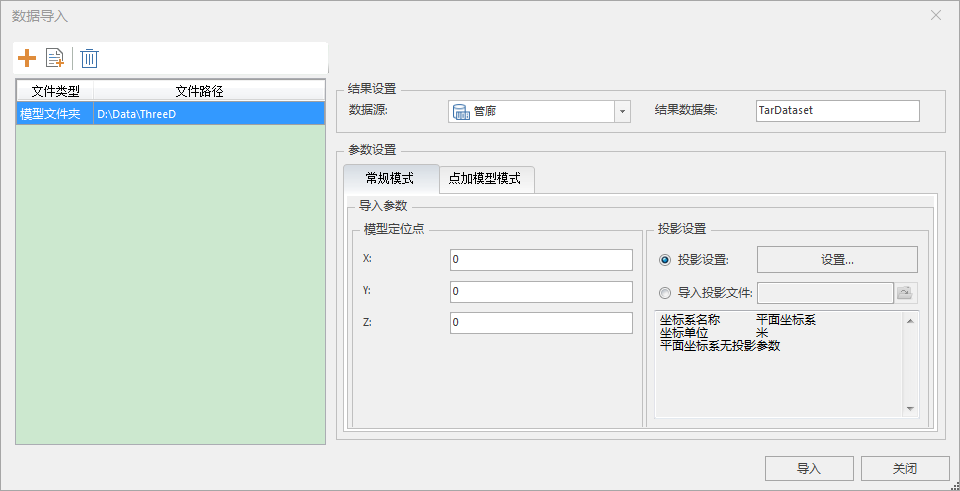
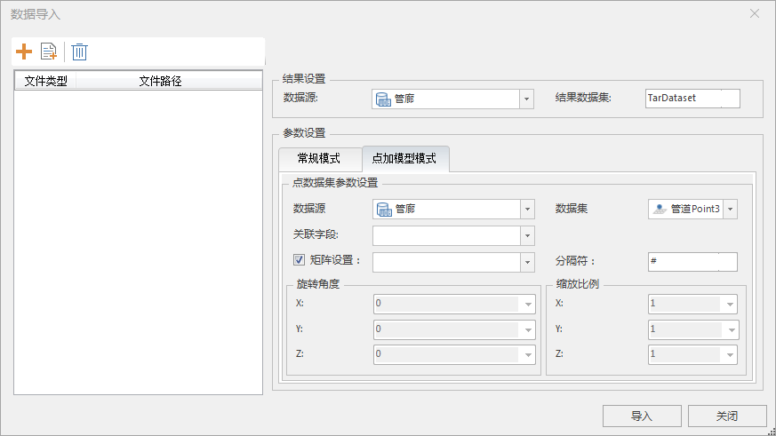
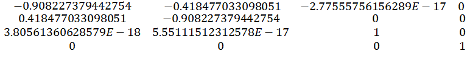

### 使用说明

支持将同一个文件夹中的模型数据批量导入，支持常规模式和点加模型模式两种导入方式，导入常规模型和点加模型建议采用此功能。采用常规模式批量导入的模型对应的是同一模型定位点
；采用点加模型模式批量导入的模型，每个模型对应的是各自的定位信息以及模型名称字段信息。支持的模型数据格式有
*.osgb、*.osg、*.s3mb、*.s3m、*.3ds、*.x、*.dxf、*.obj、*.fbx、*.dae、*.stl、*.off、*.sgm、*.skp、*.gltf、*.flt
等。

### 功能入口

* **开始** 选项卡-> **数据处理** -> **数据导入** -> **三维** -> **模型文件夹** 。
* 在工作空间管理器中选中需导入到的 **数据源** ->单击鼠标右键-> **批量导入模型...** 。

### 操作步骤

1. 在“ **开始** ”选项卡->“ **数据处理** ”->“ **数据导入** ”下拉按钮中的“ **模型文件夹** ”按钮或在工作空间管理器中选中需导入到的数据源 ，单击鼠标右键选择“批量导入模型...”菜单，弹出“数据导入”对话框。
2. 单击“添加文件”按钮，弹出“选择文件夹”对话框，在该对话框中定位到要导入的三维模型数据所在的文件夹，单击“确定”按钮。
3. 此时指定文件夹已经添加到“数据导入”对话框的列表框中，对话框右侧区域显示了导入模型文件夹需要设置的参数。
4. 结果设置中的数据源、结果数据集，请参见[数据导入公共参数](ParameterSettingDia)说明页面。
5. 导入模式分为常规模式和点加模型模式两种模式。各自的参数设置如下：
6. **常规模式：**  

  
---  
* **模型定位点** ：是指模型自身局部坐标原点的坐标，默认为0，0,0。
* **投影设置** ：支持投影设置和导入投影文件两种方式设置投影坐标系，详细操作步骤请参见“[设置投影坐标系](../Projection/PrjCoordSysDia)”。
7. **点加模型模式:**  

  
---  
* 数据源：选择模型定位点数据集所在的数据源。
* 数据集：选择模型数据的定位点数据集。
* 关联字段：设置点数据集与模型数据的关联字段，通过关联字段确定模型数据对应的点及其坐标。点关联的模型，支持相对路径和绝对路径、或模型名称（带后缀）。
* 矩阵设置：设置含有旋转缩放平移参数的4*4矩阵字段（行排列）。矩阵字段用于模型的旋转、、缩放和平移。默认勾选，勾选后需在矩阵下拉框中选择点数据集中存储矩阵的字段。若勾选则旋转角度与缩放比例不可修改。
* 分隔符：4*4矩阵用指定的分隔符隔开，如示例中“#”即为分隔符号，矩阵字段是按照从左到右，从上到下的顺序排列并以分隔符号隔开。

本案例数据重某一点数据集中存储的矩阵字段为“-0.908227379442754#-0.418477033098051#-2.77555756156289E-17#0#0.418477033098051#-0.908227379442754#0#0#3.80561360628579E-18#5.55111512312578E-17#1#0#0#0#0#1”，则相应的4*4矩阵如下图所示。

  
---  
案例数据矩阵示例  
* 旋转角度：用于设置三维模型 X、Y、Z 三个坐标方向的旋转，单击组合框右侧下拉按钮，分别选择一个字段设置为 X、Y、Z 三个方向的旋转角度，可设置为空字段。
* 缩放比例：用于设置三维模型进行 X、Y、Z 三个坐标方向拉伸，单击组合框右侧下拉按钮，分别选择一个字段设置为 X、Y、Z 三个坐标方向拉伸比例，可设置为空字段。
8. 参数设置完毕后，单击“导入”按钮，即可执行导入模型文件夹中的模型数据操作。

### 注意事项

* 模型数据导入后，模型数据集的坐标系默认与定位点数据集坐标系一致。
* 以点加模型模式导入模型数据后，导入后的结果模型数据集会保留点数据的所有属性字段信息。

