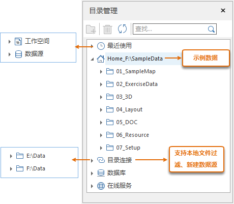

---
id: CatalogManagement
title: 目录管理  
---  
### 使用说明

目录管理为
提供一个数据目录管理窗口，组织和管理工作空间、数据源及文件目录。用户还可以与数据库数据源、在线服务建立连接。“目录管理”窗口以目录树的结构组织，结构更清晰、直观，用户可将常用的文件夹、数据源等目录创建连接，方便每一次的查找、打开。同时通过工具栏的搜索框查找文件夹及数据项，能够快速定位。目录管理包含以下具体功能：

  * **管理最近使用记录** ：包括最近使用的工作空间和数据源。
  * **管理本地目录连接** ：支持关联和移除本地目录，并支持在连接文件夹中进行新建和删除数据源文件等操作。
  * **本地文件过滤显示** ：支持对本地可用文件过滤，只显示 SuperMap 支持的文件类型，包括文件型数据源（*.udb），支持直接双击打开的外部栅格文件（*.png、*.tif、*.img等）和矢量文件（：*.shp、*.mif、*.tab、*.dwg等）；或导入数据源中。
  * **管理数据库** ：支持打开并记录数据库。
  * **管理在线服务** ：支持打开并记录 web 在线服务。

  
---  
图：“目录管理”窗口  
  
使用目录管理的关键是要将使用的文件夹、数据库、Web 服务建立连接。以下将详细介绍。

###  最近使用

**最近使用** 树节点下包括了 **工作空间** 和 **数据源**
两个子节点，每个子节点下会显示最近使用的对应内容，单击其中任意一条记录即可直接打开数据，方便用户找到和打开最近使用过的数据。

###  Home 文件连接

当您使用完整版产品安装包时，此 Home 文件连接的为安装文件夹下的 SampleData 文件夹，方便用户查看和打开示例数据。若应用程序为绿色包，此处
Home 连接的为绿色包下的 bin 文件夹作为主目录文件，支持修改文件连接。

###  建立文件夹连接

如果要在应用程序中使用磁盘中某文件夹中的内容，通过建立文件夹连接即可访问该文件夹，支持添加多个文件夹连接。并支持单击右键进行管理、查看等快捷操作。程序会过滤文件夹中的文件，只显示
SuperMap
支持的文件类型，包括文件型数据源（*.udb/*.udbx），支持直接双击打开的外部栅格文件（*.png、*.tif、*.img等）和矢量文件（：*.shp、*.mif、*.tab、*.dwg等）；或选中文件右键选择
**导入数据** ，将数据导入工作空间的数据源内。

按下列步骤从目录文件节点连接文件夹：

  1. 选择目录连接节点，在右键菜单中选择“添加文件夹连接”选项。或在工具条中单击添加按钮，以添加文件夹连接。
  2. 在“选择文件夹”对话框中浏览至本地或网络计算机上的文件夹位置路径。
  3. 单击确定建立文件夹连接。 新的连接文件已被添加到到目录树中的目录连接节点下。
  4. 对目录树中的文件夹支持通过右键菜单进行以下快捷管理操作： 
    * **断开文件夹连接** ：单击文件夹节点，在右键菜单中选择“断开文件夹连接”即可删除该文件夹的连接信息。
    * **新建数据源** ：选择文件夹节点或连接文件夹下的子文件夹节点，则可在该文件夹下创建一个新的文件型数据源（*.udb）。
    * **打开文件夹** :用于打开选中的文件夹。
    * **复制路径** ：复制所选文件的路径地址。
    * **删除** ：用于删除文件夹或文件下的数据。直接删除文件夹的数据，该操作不可恢复。
    * **刷新** ：刷新文件夹的内容。

###  连接至数据库服务器

用户可以从目录树的“数据库”节点访问数据库型数据源连接对话框，并通过该对话框连接至某一数据库数据源。

按下列步骤从数据库节点添加连接：

  1. 选择数据库节点，在右键菜单中选择“连接数据库”选项。或在工具条中单击添加按钮，弹出“打开数据库型数据源”对话框。
  2. 在“打开数据库型数据源”对话框中，选择要连接的数据库的类型，根据数据库类型提供建立连接所需的信息。数据库连接信息取决于您选择连接的数据库平台。有关详细说明，请参阅 [打开数据库数据源](OpenDatasource)。
  3. 成功连接后，新的数据库连接已被添加到目录树中的数据库节点下。
  4. 数据库连接信息支持通过右键菜单进行 **删除** 操作。

###  连接至在线服务

用户可以从目录树的“在线服务”节点访问 Web 数据源连接对话框，并通过该对话框连接至某一 Web 地图服务。

按下列步骤从在线服务节点添加连接：

  1. 选择在线服务节点，在右键菜单中选择“连接服务”选项。或在工具条中单击添加按钮，弹出“打开 Web 库型数据源”对话框。
  2. 在“打开 Web 型数据源”对话框中，选择要连接的数据源的类型，根据数据库类型提供建立连接所需的信息。连接信息取决于您选择连接的地图服务。有关详细说明，请参阅 [打开 Web 型数据源](OpenDatasource#2)。
  3. 成功连接后，新的 Web 地图服务连接已被添加到目录树中的在线服务节点下。
  4. 在线服务库连接信息支持通过右键菜单进行 **删除** 操作。

### 注意事项

当目录管理窗口不小心被关闭了，可在“视图”选项卡中“视图”组勾选“目录管理”前的复选框，重新调出“目录管理”窗口。
