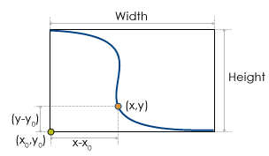
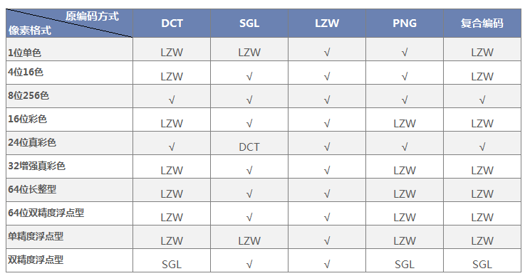

---
id: EncodeType
title: 数据集压缩编码方式  
---  
### 编码方式

根据不同的应用目的为 GIS 数据设置合理的编码方式，其对提高系统运行的效率，节省存储空间非常有利。
中，提供了多种编码方式，其各自的特点及适用情况，如下表所示:

编码方式 | 描述  
---|---  
未编码 | 不使用编码方式。  
SGL |SGL（SuperMap Grid LZW），SuperMap 自定义的一种压缩存储格式。其实质是改进的 LZW 编码方式。  SGL 对 LZW 进行了改进，是一种更高效的压缩存储方式。 目前 SuperMap 中的对 Grid 数据集和 DEM 数据集压缩存储采用的就是 SGL 的压缩编码方式，这是一种无损压缩，适用于栅格数据集。    
DCT |DCT（Discrete Cosine Transform），离散余弦编码，是一种广泛应用于图像压缩中的变换编码方法。  这种变换方法在信息的压缩能力、重构图像质量、适应范围和算法复杂性等方面之间提供了一种很好的平衡，成为目前应用最广泛的图像压缩技术。  其原理是通过变换降低图像原始空间域表示中存在的非常强的相关性，使信号更紧凑地表达。该方法有很高的压缩率和性能，但编码是有失真的。  由于影像数据集一般不用来进行精确的分析，所以 DCT 编码方式是影像数据集存储的压缩编码方式，适用于影像数据集。  
LZW |LZW 是一种广泛采用的字典压缩方法，其最早是用在文字数据的压缩方面。LZW的编码的原理是用代号来取代一段字符串，后续的相同的字符串就使用相同代号，所以该编码方式不仅可以对重复数据起到压缩作用，还可以对不重复数据进行压缩操作。适用于索引色影像的压缩方式，这是一种无损压缩编码方式，适用于栅格和影像数据集。   
PNG |PNG 压缩编码方式，支持多种位深的图像，是一种无损压缩方式，适用于影像数据集。   
JPEG |JPEG是一种有损压缩的方式，在保证视觉效果无差异的前提下，压缩比可达到1/20至1/40，压缩程度较高，适用于作为背景图的影像数据。  
复合编码 | 数据集复合编码方式，其压缩比接近于 DCT 编码方式，主要针对 DCT 压缩导致的边界影像块失真的问题。（适用于 RGB 格式的影像数据集）。  
四字节  | 四字节编码方式。使用四个字节存储一个坐标值，适用于矢量数据，但不适用于二维点数据集、纯属性数据集、CAD 数据集和三维矢量数据集。  
三字节  | 三字节编码方式。使用三个字节存储一个坐标值，适用于矢量数据，但不适用于二维点数据集、纯属性数据集、CAD 数据集和三维矢量数据集。  
双字节  | 双字节编码方式。使用两个字节存储一个坐标值，适用于矢量数据，但不适用于二维点数据集、纯属性数据集、CAD 数据集和三维矢量数据集。  
单字节  | 单字节编码方式。使用一个字节存储一个坐标值，适用于矢量数据，但不适用于二维点数据集、纯属性数据集、CAD 数据集和三维矢量数据集。  
  

### 编码类型适用范围

对 **矢量数据集**
支持四种压缩编码方式，即单字节，双字节，三字节和四字节编码方式，这四种压缩编码方式采用相同的压缩编码机制，但是压缩的比率不同，其均为有损压缩。

对栅格数据，可以采用四种压缩编码方式，即 DCT、SGL、LZW 和 复合编码。其中 DCT
和复合编码为有损压缩编码方式，SGL和LZW为无损压缩编码方式。

需要注意的是点数据集、纯属性数据集以及 CAD 数据集不可压缩编码。

  * 对矢量的压缩编码方式，以线数据集的单字节编码为例，说明其压缩编码的机制。假设未压缩的线数据集的空间数据是以双精度数据类型存储的，现使用单字节压缩编码方式对其进行压缩存储。
  
---  
  
如图所示为线数据集中的一个对象，其最小外接矩形的宽度为Width，高度为Height，则用单字节编码进行压缩的比率为： **ratio =
max(Width,Height)/255** 。

其中255是单字节所能表示的最大数值。设线对象的左下角点的坐标为（x0，y0），则对于线对象上的某个点（x,
y），其编码后的坐标为：x’=byte[(x-x0)/ratio] y’=byte[(y-y0)/ratio]

因而编码之后的点的坐标以字节型数据类型存储，则数据集的存储空间为未编码时存储空间的1/8。显然在将双精度（8Byte）类型编码成字节（1Byte）类型时，精度是有损失的。对于坐标值来说，最大精度损失值为ratio。

对于其他矢量压缩编码方式，其原理一样，压缩后坐标精度的最大损失为 **ratio = max（Width, Height）/maxValue 。**

其中，Width和Height为几何对象的最小外接矩形的宽度和高度，maxValue为编码方式的数据类型所能表示的数值的最大值（单字节编码最大值为255，双字节编码最大值为65535，三字节编码最大值为16777215，四字节编码最大值为4294967295）。

  * 对于影像和栅格数据集，根据其像素格式选择合适的压缩编码方式，对提高系统运行的效率，节省存储空间非常有利。下表列出了影像和栅格数据集不同像素格式对应的合理的编码方式。例如：像素格式为1位单色的数据，支持LZW、PNG的原始编码方式，当原编码方式为DCT、SGL及复合编码时，可选择LZW的编码格式。
  
---  
  
**注意** ：栅格数据集只支持LZW
SGL，当原编码方式为DCT、复合编码时，可选择SGL的编码方式。8位影像的非灰色度调色板不支持DCT编码，可转为LZW的编码方式。

### 数据集编码方式的使用

数据集编码方式可以通过新建数据集、复制数据集、导入数据集和导出影像数据集等功能进行修改，或者可以右键单击某一数据集，在属性信息窗口中查看该数据集的编码方式。

### 新建数据集

新建矢量数据集时，可以为其设置编码方式。对于不同类型的数据集，会下拉菜单中提供可用的编码方式。

### 复制数据集

复制数据集的同时，可以为其设置编码方式。对于不同类型的数据集，会下拉菜单中提供可用的编码方式。

不同类型的数据集和与其相匹配的编码方式参见下表：

**表1：不同类型的数据集的编码方式**    

数据集类型 | 编码方式  
---|---
矢量数据集 | 单字节、双字节、三字节、四字节  
DEM/Grid 数据集 | SGL,LZW  
影像数据集 | LZW,DCT,PNG  
  
### 导入数据集

外部格式的数据导入到 中时，可以选择编码方式。其中，image 影像数据集的默认编码方式为 DCT 编码，其它格式的默认编码方式均为未编码。

### 导出影像数据集

在  中，在地图窗口内单击鼠标右键，在出现的右键菜单中选择“输出为影像数据集…”，其编码方式可选择 DCT、LZW、PNG 或者 None（即不采用编码）。

