管理镶嵌数据集包括：浏览轮廓属性表、添加镶嵌数据、重新指定路径、构建概视图、重建边界、清除数据、统计信息、导出数据、创建影像金字塔等，下文将对以上操作进行详细描述。

###  浏览镶嵌数据集属性

选择数据源列表中的镶嵌数据集，右键单击“浏览轮廓属性表”，打开镶嵌数据集的属性表，实质为轮廓线的属性表，其中每一条记录对应一个轮廓对象。属性表主要字段内容:

* **SmFileName** ：添加到镶嵌数据集中管理的所有原始影像的文件名称（不包括扩展名）以及概视图文件名称（包含扩展名）。
* **SmPath** ：添加到镶嵌数据集中管理的所有原始影像文件的全路径（绝对路径）以及概视图文件全路径，这些路径支持网络共享路径。因此可以通过编辑该字段实现镶嵌数据集的共享使用。
* **SmCategory** ：用于标识影像轮廓线内当前显示的图像是原始影像文件还是概视图，1标识原始影像文件；2表示概视图。 
* **SmMinPS** ：定义图像的下限，因此，无法处理任何低于该值的图像请求。默认值是 0，但可以将其设置为更大的值，以限制可以访问图像的分辨率。如果发出低于此分辨率的请求，则请求失败，不返回图像。 
* **SmMaxPS** ：定义图像的上限，因此，无法处理任何高于该值的图像请求。与最小像元大小的默认值不同，最大像元大小的默认值是数值较大的数。如果发出高于此分辨率的请求，则请求失败，返回灰色图像。 
* **SmMinPS** 和 **SmMaxPS** ：SmMinPS和SmMaxPS定义像元大小范围。根据该范围确定镶嵌数据集使用哪一分辨率影像数据进行显示。系统根据影像金字塔和图像之间的叠加来计算SmMinPS和SmMaxPS值。 
* **SmLowPS** 和 **SmHighPS** 两个字段定义了栅格数据集所包含的象元（像素）大小的实际范围，SmLowPS为影像真实分辨率，SmHighPS为影像金字塔分辨率。
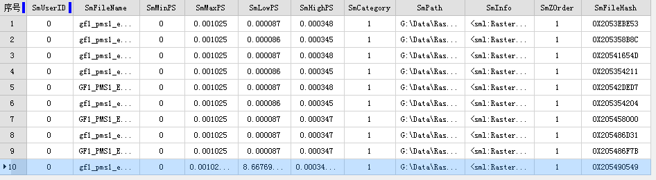  
---  

###  添加镶嵌数据

在完成创建镶嵌数据集之后，可继续将.tif、.tiff、.img影像文件的添加至当前镶嵌数据集中。

**功能入口**

选择数据源列表中的镶嵌数据集，右键单击“添加镶嵌数据”，打开“添加镶嵌数据”对话框,在此对话框中可添加新的影像文件。工具栏区域，提供了添加影像工具按钮，可通过单个文件、文件夹及文件夹清单三种形式添加。影像文件列表添加完毕后，影像文件路径等信息就写入镶嵌数据集中。

###  创建影像金字塔

为镶嵌数据集创建影像金字塔，目的是提高大批量影像数据的显示效率。程序会对原始影像按照某种规则构建多层金字塔，不同比例尺下显示相应分辨率的金字塔影像。且在镶嵌数据集构建概视图时，必须要求镶嵌数据集中的所有影像具有金字塔，以提高数据浏览速度。

**功能入口**

选择数据源列表中的镶嵌数据集，右键单击“创建影像金字塔”,打开“创建影像金字塔”对话框。

**参数描述** ：对创建影像金字塔的参数进行设置，包括重采样方法、编码方式及任务数设置。

* 程序提供了如下几种重采样的方法，具体说明请参见[栅格编码方式](../../DataProcessing/DataManagement/EncodeType)。
* **最领近法** ，将输入栅格数据集中最邻近的像元值作为输入值，赋予输出栅格数据集的相应像元。
* **平均值法** ，计算所有有效值的均值进行重采样计算。
* **高斯内核计算法** ，使用高斯内核计算的方式进行重采样，这种对于高对比度和图案边界比较明显的图像效果比较好。
* **平均联合数据法** ，在一个magphase空间中平均联合数据，用于复数数据空间的图像的重采样方式。
* **编码方式：** 程序提供了 **DEFLATE** 、 **JPEG** 、 **LZW** 三种编码方式，可以根据实际应用需要，平衡金字塔的显示质量和占用存储空间的关系。具体说明请参见[重采样方法介绍。](../../DataProcessing/Registration/resamplemethod)
* **任务数** :设置参与创建金字塔的线程数，使创建影像金字塔更加高效。

###  构建概视图

为了提高镶嵌数据集的显示效率，数据默认小比例尺下只显示镶嵌轮廓线，不显示原始影像。

**功能入口**

选择数据源列表中的镶嵌数据集，右键单击“构建概视图”，打开“构建概视图”对话框。

**参数描述** ：对概视图最大宽度、最大高度、采样系数以及输出路径进行设置。

* **最大宽度和高度** ：概视图影像文件的最大宽度和高度。
* **采样系数** :相邻两层概视图的分辨率比率。
* **输出路径** :概视图影像文件的存放路径。
* **去除无值压盖** :多景影像拼接处可能存在无值区域与有值区域压盖导致黑边的情况，在创建概视图时，可指定无值的数值，在构建概视图后，获得正确的压盖区域显示效果。图为设置无值压盖对比图：  
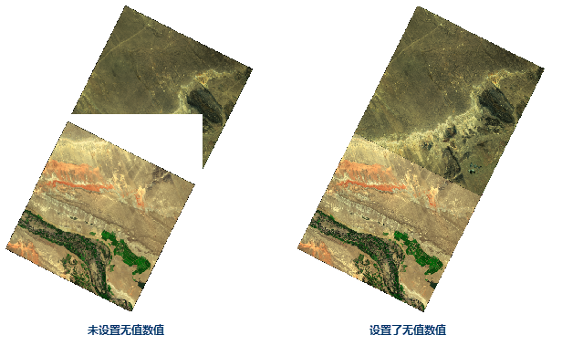  
---  

* **多任务执行** ：支持设置开启多个进程来执行概视图的构建，提高构建速率，进程数需要根据机器的配置和进程使用情况来设置。

镶嵌数据集构建概视图，是对原始影像按照某种规则重建多层金字塔，用于小比例尺下显示，构建了概视图后，在概视图输出路径下将产生影像文件，并且在轮廓子数据集的属性中，追加了概视图相关记录，包括概视图影像文件的文件名和路径、影像文件分辨率信息等信息。图为轮廓属性表中增加概视图记录：

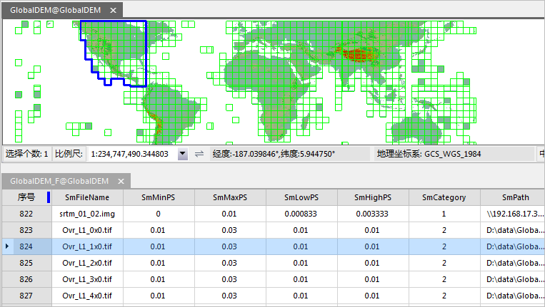  
---  
 

###  重新指定路径

若镶嵌数据集中的原始影像文件位置发生变化，或需要重新指定生成概视图的路径，可通过“重新指定路径”对文件位置路径进行更改。

**功能入口**

选择数据源列表中的镶嵌数据集，右键单击“重新指定路径”，打开“重新指定路径”对话框,在对话框中更改镶嵌数据集中已有文件列表中文件的路径，包括原始影像文件路径和概视图路径。

**参数描述**

* **原始影像文件路径** :如果创建镶嵌数据集之后原始路劲的影像位置发生移动，或者将影像数据放于某个共享路径中时，只需要将此处文件路径更新为现数据所在路径，即可重新调取数据。
* **概视图文件路径** ：更改存放概视图的存放位置。

###  清除数据

**功能入口**

选择数据源列表中的镶嵌数据集，右键单击“清除数据”,打开“清除数据”对话框。

可选择“从镶嵌数据集移除所有记录（包括概视图）”删除所有数据，也可选择“仅删除概视图”把已创建的概视图从数据集中删除。

###  重建范围

当镶嵌数据集中的数据发生变化时，例如：删除某些影像、增加新的影像、影像存在裁剪范围数据等情况，单击此功能可对镶嵌数据集重建范围。有关重建范围的应用请参看[影像地图配置-
重建数据范围。](MosaicDatasetView.htm#1)

**功能入口**

选择数据源列表中的镶嵌数据集，右键单击“重建范围”，打开“重新范围”对话框。

**参数描述**

重建范围对话框中提供三种范围更新选择：重建轮廓、重建边界、重建裁剪范围，用户可选择一种范围进行更新，同时支持多选。

* **重建轮廓** ：勾选该复选框可重建镶嵌数据集轮廓范围。
* **重建边界** ：勾选该复选框可重建影像边界范围，设置边界重建范围可通过自动计算边界范围、选择数据集范围和自定义范围三种种方式。
* **选择数据集范围** ：通过选择数据源中的面数据集作为重建范围。
* **自定义范围** ：通过绘制范围和选择对象确定更新范围。点击右侧下拉按钮可选择“绘制范围”和“选择对象”两种方式选择边界更新范围。
* **重建裁剪范围** ：勾选该复选框可重建裁剪范围。提供三种裁剪方式： 
* **使用轮廓范围** ：即可基于影像的轮廓构建其裁剪区，并更新到裁剪子数据集中。 

**裁剪偏移** ：当影像轮廓所确定的裁剪区，其边界存在一些无值，可设置“裁剪偏移”量，从而使裁剪区小于轮廓，即为影像轮廓向内缩小指定像素值后的区域。

* **自动计算裁剪范围**

影像有效区域的形状，大致分为两种情况，一种是凸多边形的情况，如下图，影像有效区域为规则的平行四边形，属于凸多边形，另一种是非凸多边形的情况，也就是不规则形状。

 | 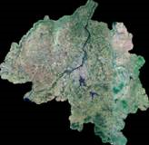  
---|---  
图为影像有效区域为凸多边形 | 图为影像有效区域为不规则形状  

针对影像有效区域形状的不同，在执行自动计算裁剪范围前，需要注意启用对应的设置项。

对于有效区域为不规则的形状，必须勾选“复杂多边形”；对于有效区域为凸多边形形状，无需勾选“复杂多边形”选项，但若勾选该项，同样可以获得正确裁剪区。

若勾选“精确裁剪”选项，裁剪区的计算将基于原始影像数据，因此更加精确，若不勾选“精确裁剪”，裁剪区的计算将基于影像金字塔进行，虽然计算精度不如基于原始影像数据的，但是计算速度快。

自动计算裁剪范围操作在提取影像有效边界时，将非无值的像元判断为有效区，
当“容限”值为0时，也是默认值，无值为唯一值，当“容限”值为非0时，无值将为该容限内的多个值。因此，设置容限后，可以去除影像有效边界上接近无值的杂质像元。

此外，针对有效区域为凸多边形形状的情况，勾选“复杂多边形”也可以获得正确结果。
<table class=MsoNormalTable border=1 cellspacing=0 cellpadding=0
 style='border-collapse:collapse;border:none'>
 <tr style='height:20.8pt'>
  <td width=199 style='width:149.5pt;border:solid #BFBFBF 1.0pt;background:
  #F2F2F2;padding:0cm 5.4pt 0cm 5.4pt;height:20.8pt'>
  
<b>原始影像文件</b>

  </td>
  <td width=187 style='width:140.4pt;border:solid #BFBFBF 1.0pt;border-left:
  none;background:#F2F2F2;padding:0cm 5.4pt 0cm 5.4pt;height:20.8pt'>
  
<b>裁剪区自动计算结果</b>

  </td>
  <td width=206 colspan=2 style='width:154.7pt;border:solid #BFBFBF 1.0pt;
  border-left:none;background:#F2F2F2;padding:0cm 5.4pt 0cm 5.4pt;height:20.8pt'>
  
<b>支持情况</b>

  </td>
 </tr>
 <tr style='height:56.4pt'>
  <td width=199 rowspan=2 valign=top style='width:149.5pt;border:solid #BFBFBF 1.0pt;
  border-top:none;padding:0cm 5.4pt 0cm 5.4pt;height:56.4pt'>
  
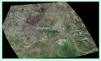

  
3波段 8位无符号IMG影像

  
无值：0

  </td>
  <td width=187 rowspan=2 valign=top style='width:140.4pt;border-top:none;
  border-left:none;border-bottom:solid #BFBFBF 1.0pt;border-right:solid #BFBFBF 1.0pt;
  padding:0cm 5.4pt 0cm 5.4pt;height:56.4pt'>
  
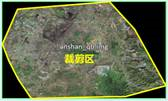

  </td>
  <td width=103 style='width:77.5pt;border-top:none;border-left:none;
  border-bottom:solid #BFBFBF 1.0pt;border-right:solid #BFBFBF 1.0pt;
  padding:0cm 5.4pt 0cm 5.4pt;height:56.4pt'>
  
基于原始影像精确计算

  </td>
  <td width=103 style='width:77.2pt;border-top:none;border-left:none;
  border-bottom:solid #BFBFBF 1.0pt;border-right:solid #BFBFBF 1.0pt;
  padding:0cm 5.4pt 0cm 5.4pt;height:56.4pt'>
  
<b>√</b>

  </td>
 </tr>
 <tr>
  <td width=103 style='width:77.5pt;border-top:none;border-left:none;
  border-bottom:solid #BFBFBF 1.0pt;border-right:solid #BFBFBF 1.0pt;
  padding:0cm 5.4pt 0cm 5.4pt'>
  
基于金字塔计算

  </td>
  <td width=103 style='width:77.2pt;border-top:none;border-left:none;
  border-bottom:solid #BFBFBF 1.0pt;border-right:solid #BFBFBF 1.0pt;
  padding:0cm 5.4pt 0cm 5.4pt'>
  
<b>√</b>

  </td>
 </tr>
 <tr style='height:88.4pt'>
  <td width=199 rowspan=2 valign=top style='width:149.5pt;border:solid #BFBFBF 1.0pt;
  border-top:none;padding:0cm 5.4pt 0cm 5.4pt;height:88.4pt'>
  

  
3波段 8位无符号IMG影像

  
无值：0

  </td>
  <td width=187 rowspan=2 valign=top style='width:140.4pt;border-top:none;
  border-left:none;border-bottom:solid #BFBFBF 1.0pt;border-right:solid #BFBFBF 1.0pt;
  padding:0cm 5.4pt 0cm 5.4pt;height:88.4pt'>
  
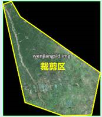

  </td>
  <td width=103 style='width:77.5pt;border-top:none;border-left:none;
  border-bottom:solid #BFBFBF 1.0pt;border-right:solid #BFBFBF 1.0pt;
  padding:0cm 5.4pt 0cm 5.4pt;height:88.4pt'>
  
基于原始影像精确计算

  </td>
  <td width=103 style='width:77.2pt;border-top:none;border-left:none;
  border-bottom:solid #BFBFBF 1.0pt;border-right:solid #BFBFBF 1.0pt;
  padding:0cm 5.4pt 0cm 5.4pt;height:88.4pt'>
  
<b>√</b>

  </td>
 </tr>
 <tr>
  <td width=103 style='width:77.5pt;border-top:none;border-left:none;
  border-bottom:solid #BFBFBF 1.0pt;border-right:solid #BFBFBF 1.0pt;
  padding:0cm 5.4pt 0cm 5.4pt'>
  
基于金字塔计算

  </td>
  <td width=103 style='width:77.2pt;border-top:none;border-left:none;
  border-bottom:solid #BFBFBF 1.0pt;border-right:solid #BFBFBF 1.0pt;
  padding:0cm 5.4pt 0cm 5.4pt'>
  
<b>√</b>

  </td>
 </tr>
 <tr style='height:71.8pt'>
  <td width=199 rowspan=2 valign=top style='width:149.5pt;border:solid #BFBFBF 1.0pt;
  border-top:none;padding:0cm 5.4pt 0cm 5.4pt;height:71.8pt'>
  

  
单波段8位无符号 IMG影像

  
无值：0

  </td>
  <td width=187 rowspan=2 valign=top style='width:140.4pt;border-top:none;
  border-left:none;border-bottom:solid #BFBFBF 1.0pt;border-right:solid #BFBFBF 1.0pt;
  padding:0cm 5.4pt 0cm 5.4pt;height:71.8pt'>
  
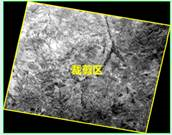

  </td>
  <td width=103 style='width:77.5pt;border-top:none;border-left:none;
  border-bottom:solid #BFBFBF 1.0pt;border-right:solid #BFBFBF 1.0pt;
  padding:0cm 5.4pt 0cm 5.4pt;height:71.8pt'>
  
基于原始影像精确计算

  </td>
  <td width=103 style='width:77.2pt;border-top:none;border-left:none;
  border-bottom:solid #BFBFBF 1.0pt;border-right:solid #BFBFBF 1.0pt;
  padding:0cm 5.4pt 0cm 5.4pt;height:71.8pt'>
  
<b>√</b>

  </td>
 </tr>
 <tr>
  <td width=103 style='width:77.5pt;border-top:none;border-left:none;
  border-bottom:solid #BFBFBF 1.0pt;border-right:solid #BFBFBF 1.0pt;
  padding:0cm 5.4pt 0cm 5.4pt'>
  
基于金字塔计算

  </td>
  <td width=103 style='width:77.2pt;border-top:none;border-left:none;
  border-bottom:solid #BFBFBF 1.0pt;border-right:solid #BFBFBF 1.0pt;
  padding:0cm 5.4pt 0cm 5.4pt'>
  
<b>√</b>

  </td>
 </tr>
 <tr style='height:77.35pt'>
  <td width=199 rowspan=2 valign=top style='width:149.5pt;border:solid #BFBFBF 1.0pt;
  border-top:none;padding:0cm 5.4pt 0cm 5.4pt;height:77.35pt'>
  

  
3波段 8位无符号IMG影像

  
无值：0

  </td>
  <td width=187 rowspan=2 valign=top style='width:140.4pt;border-top:none;
  border-left:none;border-bottom:solid #BFBFBF 1.0pt;border-right:solid #BFBFBF 1.0pt;
  padding:0cm 5.4pt 0cm 5.4pt;height:77.35pt'>
  
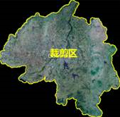

  </td>
  <td width=103 style='width:77.5pt;border-top:none;border-left:none;
  border-bottom:solid #BFBFBF 1.0pt;border-right:solid #BFBFBF 1.0pt;
  padding:0cm 5.4pt 0cm 5.4pt;height:77.35pt'>
  
基于原始影像精确计算

  </td>
  <td width=103 style='width:77.2pt;border-top:none;border-left:none;
  border-bottom:solid #BFBFBF 1.0pt;border-right:solid #BFBFBF 1.0pt;
  padding:0cm 5.4pt 0cm 5.4pt;height:77.35pt'>
  
<b>√</b>

  </td>
 </tr>
 <tr>
  <td width=103 style='width:77.5pt;border-top:none;border-left:none;
  border-bottom:solid #BFBFBF 1.0pt;border-right:solid #BFBFBF 1.0pt;
  padding:0cm 5.4pt 0cm 5.4pt'>
  
基于金字塔计算

  </td>
  <td width=103 style='width:77.2pt;border-top:none;border-left:none;
  border-bottom:solid #BFBFBF 1.0pt;border-right:solid #BFBFBF 1.0pt;
  padding:0cm 5.4pt 0cm 5.4pt'>
  
<b>√</b>

  </td>
 </tr>
 <tr style='height:161.05pt'>
  <td width=199 rowspan=2 valign=top style='width:149.5pt;border:solid #BFBFBF 1.0pt;
  border-top:none;padding:0cm 5.4pt 0cm 5.4pt;height:161.05pt'>
  
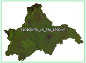

  
7波段 8位无符号 TIFF影像

  
坐标系：EPSG:4326

  
影像大小：238M

  
无值：255

  
影像有效值区域形象特殊之处：

  
[1]
  类似飞地，与主体有效值区域有一个像素连接点

  
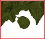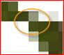

  
[2]
  飞地，与主体有效区域没有连接

  

  
&nbsp;

  
&nbsp;

  </td>
  <td width=187 rowspan=2 valign=top style='width:140.4pt;border-top:none;
  border-left:none;border-bottom:solid #BFBFBF 1.0pt;border-right:solid #BFBFBF 1.0pt;
  padding:0cm 5.4pt 0cm 5.4pt;height:161.05pt'>
  
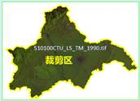

  
&nbsp;

  
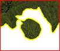

  
类似飞地裁剪正确

  
&nbsp;

  
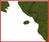

  
飞地由于面积太小所以忽略

  </td>
  <td width=103 style='width:77.5pt;border-top:none;border-left:none;
  border-bottom:solid #BFBFBF 1.0pt;border-right:solid #BFBFBF 1.0pt;
  padding:0cm 5.4pt 0cm 5.4pt;height:161.05pt'>
  
基于原始影像精确计算

  </td>
  <td width=103 style='width:77.2pt;border-top:none;border-left:none;
  border-bottom:solid #BFBFBF 1.0pt;border-right:solid #BFBFBF 1.0pt;
  padding:0cm 5.4pt 0cm 5.4pt;height:161.05pt'>
  
<b>√</b>

  </td>
 </tr>
 <tr>
  <td width=103 style='width:77.5pt;border-top:none;border-left:none;
  border-bottom:solid #BFBFBF 1.0pt;border-right:solid #BFBFBF 1.0pt;
  padding:0cm 5.4pt 0cm 5.4pt'>
  
基于金字塔计算

  </td>
  <td width=103 style='width:77.2pt;border-top:none;border-left:none;
  border-bottom:solid #BFBFBF 1.0pt;border-right:solid #BFBFBF 1.0pt;
  padding:0cm 5.4pt 0cm 5.4pt'>
  
<b>√</b>

  </td>
 </tr>
 <tr style='height:127.1pt'>
  <td width=199 rowspan=2 valign=top style='width:149.5pt;border:solid #BFBFBF 1.0pt;
  border-top:none;padding:0cm 5.4pt 0cm 5.4pt;height:127.1pt'>
  
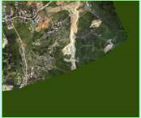

  
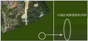

  
3波段 8位无符号 TIFF影像

  
无值：无值不唯一，有多个无值

  </td>
  <td width=187 style='width:140.4pt;border-top:none;border-left:none;
  border-bottom:solid #BFBFBF 1.0pt;border-right:solid #BFBFBF 1.0pt;
  padding:0cm 5.4pt 0cm 5.4pt;height:127.1pt'>
  
暂不支持有多个无值的影像的有效值区域的自动计算

  </td>
  <td width=103 style='width:77.5pt;border-top:none;border-left:none;
  border-bottom:solid #BFBFBF 1.0pt;border-right:solid #BFBFBF 1.0pt;
  padding:0cm 5.4pt 0cm 5.4pt;height:127.1pt'>
  
基于原始影像精确计算

  </td>
  <td width=103 style='width:77.2pt;border-top:none;border-left:none;
  border-bottom:solid #BFBFBF 1.0pt;border-right:solid #BFBFBF 1.0pt;
  padding:0cm 5.4pt 0cm 5.4pt;height:127.1pt'>
  
<b>--</b>

  
<b>&nbsp;</b>

  </td>
 </tr>
 <tr>
  <td width=187 valign=top style='width:140.4pt;border-top:none;border-left:
  none;border-bottom:solid #BFBFBF 1.0pt;border-right:solid #BFBFBF 1.0pt;
  padding:0cm 5.4pt 0cm 5.4pt'>
  
&nbsp;

  </td>
  <td width=103 style='width:77.5pt;border-top:none;border-left:none;
  border-bottom:solid #BFBFBF 1.0pt;border-right:solid #BFBFBF 1.0pt;
  padding:0cm 5.4pt 0cm 5.4pt'>
  
基于金字塔计算

  </td>
  <td width=103 style='width:77.2pt;border-top:none;border-left:none;
  border-bottom:solid #BFBFBF 1.0pt;border-right:solid #BFBFBF 1.0pt;
  padding:0cm 5.4pt 0cm 5.4pt'>
  
<b>--</b>

  </td>
 </tr>
</table>

* **读取裁剪文件**

这种获得影像裁剪区的方式适用于已经具有每幅影像的裁剪区面对象，要求每幅影像裁剪区存放在独立的 .shp 文件中，并且该 .shp
文件名称与对应影像文件同名。

另外，在添加影像到镶嵌数据集中时，也提供了读取裁剪文件来更新裁剪子数据集的入口，详细说明可参看[创建镶嵌数据集-
读取裁剪范围](CreateMosaicDataset.htm#13)"，若影像无对应的 .shp 文件，裁剪区仍默认为影像的轮廓。

读取裁剪文件的方式比较适合下面的影像，单幅影像有效区域以外的无值区域，无值并非单一值，这类影像不支持自动提取裁剪区。图为影像无值区域的无值不唯一 ： 

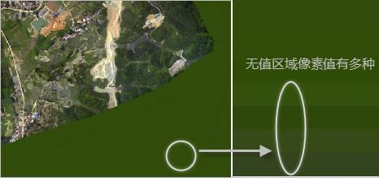  
---  

获取了影像裁剪区，就可以使用裁剪区来控制影像只显示其有效范围，在影像图层的属性面板中，将“裁剪类型”设置为“数据裁剪”，此时，将使用裁剪子数据集裁剪显示影像，具体操作请参看[裁剪显示影像](MosaicDatasetView.htm#1)"。

**注意** ：由于概视图的创建也会使用影像的裁剪区，因此，若重建了裁剪范围，您可以根据概视图的显示需要考虑是否重建概视图。

###  统计信息

统计信息是为镶嵌数据集的显示设置不同的拉伸方式做数据准备。设置拉伸方式需要统计镶嵌数据信息，如若再此处没有统计信息，在设置镶嵌数据集显示拉伸方式时，系统会弹出提示框提示先统计镶嵌数据信息。

**功能入口**

选择数据源列表中的镶嵌数据集，右键单击“统计信息”，程序将逐个统计镶嵌数据集中影像的最大值、最小值、均值、标准差、方差等信息。每个影像会在影像存储的文件夹内生成单独的统计信息文件（*.xml），文件名称与影像文件名称相同。

###  导出数据

**功能入口**

选择数据源列表中的镶嵌数据集，右键单击“导出数据”,打开“导出数据”对话框。

**参数描述** ：程序提供了两种导出方式分别是：导出文件和导出文件清单。用户可根据需求选取一种导出形式。两种导出方式均支持设置以下参数：

* **选择范围** ：可设置导出文件或文件清单的范围。通过选择整幅地图、在地图窗口绘制范围、选择对象以及通过复制、粘帖已有范围的坐标值四种方式。需要注意的是绘制范围必须保证镶嵌数据集处于地图打开状态。选择对象需要当前地图窗口中存在面数据集选择对象才可用。
* **参数设置** :程序提供两种导出类型：仅导出影像数据和导出概视图。可选择其中一种，也可同时选择。即当选择导出文件方式时，导出的即为设置范围之内的影像数据和概视图数据。若选择导出文件清单，导出的即为设置范围之内的影像数据的文件列表及概视图文件列表。
* **保存结果** ：设置导出数据的输出路径。 
* **另存为数据集** :也可选择另存数据集，勾选此复选框，选择另存数据源及数据集。

###  更新影像文件列表

当前镶嵌数据集中的数据发生变化，例如：需要删除某些影像、增加新的影像、或者影像文件的路径发生变化等，就需要通过下面的功能对镶嵌数据集进行更新。

* **添加镶嵌数据** ：为镶嵌数据集添加影像文件。
* **构建概视图** ：当镶嵌数据集中的文件发生变化后，重新构建概视图来更新概视图影像。
* **重新指定路径** ：修改镶嵌数据集中已有文件列表中文件的路径，包括原始影像文件路径和概视图路径。
* **清除数据** ：清除镶嵌数据集中所管理的影像列表，可以清除原始影像文件但保留概视图，也可以全部清除使镶嵌数据集为空。
* **重建边界** :在当前镶嵌数据集中的数据发生变化，例如：删除某些影像、增加新的影像等情况，需要重建数据的边界，单击此功能对镶嵌数据集边界进行更新。

###  相关主题

 [镶嵌数据集概述](MosaicDataset)

 [镶嵌数据集显示](MosaicDatasetView)

 [基于镶嵌数据集配置影像地图](MosaicDatasetMapConfig)

 [创建镶嵌数据集](CreateMosaicDataset)

