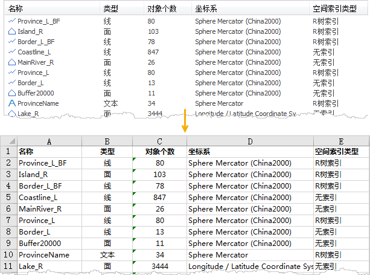

工作空间管理窗口以图标平铺排列的形式显示并管理当前工作空间的内容，包括数据源、地图、布局、场景、图表、模型、资源。工作空间管理窗口中提供了与工作空间管理器一致的操作，支持数据和资源的管理，例如新建、打开、关闭数据源，新建、复制、删除数据集等，并且数据源和数据集右键菜单操作与在工作空间管理器中一致。

桌面提供以下两种打开 **工作空间管理器** 窗口方式：

  * 在 **视图** ->勾选 **工作空间管理器窗口** 复选框，即可打开工作空间管理器窗口。
  * 在工作空间管理器工具栏中，单击“工作空间管理器窗口”图标按钮，即可打开工作空间管理器窗口，再次单击该按钮，即可将窗口关闭。

在窗口中双击任意图标，即可查看对应内容的子对象，例如：双击“数据源”图标，即可显示当前工作空间下的所有数据源，再双击其中某个数据源，即可在窗口中显示该数据源下的所有数据集。

工作空间管理窗口可联动显示工作空间管理器中选中项中的子项，例如，在工作空间管理器中选中了“数据源”节点，则工作空间管理器窗口中会显示当前工作空间中的所有数据源；若在工作空间管理器中选中了“China”数据源，则窗口中会显示该数据源下的所有数据集。

工作空间管理窗口中的工具栏及窗口空白处的右键菜单，支持上一级、回退、前进、显示方式、排序、刷新、导出等操作，具体的操作说明如下：

  * **上一级** ：返回当前窗口内容的上一级内容，例如，当前窗口显示的是数据集内容，通过“上一级”可将当前窗口内容切换为显示数据源内容。
  * **回退** ：返回上一个窗口视图内容。
  * **前进** ：显示下一个窗口视图内容。
  * **显示方式** ：应用程序提供了大图标、小图标、列表、详细四种方式，其中“详细”显示方式会显示各项内容的名称、类型、对象个数和路径，根据详细信息可方便的对各项内容进行管理，如：根据数据集的详细信息，删除对象个数为 0 的矢量数据集。
  * **排序** ：提供了名称、类型、创建时间、对象个数四种排序方式，具体的排列顺序如下： 
    * **名称** ：按照字母进行排序。
    * **类型** ：按照属性表、矢量数据（点、线、面）、文本、影像、栅格、三维数据（点、线、面）、CAD、模型数据进行排序。
    * **创建时间** ：根据数据创建的时间由早到晚进行排序。
    * 对 **象个数** ：根据数据的对象个数按照升序进行排序。
  * **刷新** ：刷新当前界面中的显示内容。
  * **导出内容到表格** ：单击工具栏中的 **导出内容到表格** 按钮，可将当前窗口中的显示信息导出到 Excel 中，包括：工作空间、数据源、数据集等信息。如下图所示，工作空间管理器窗口中显示了数据源中数据集的信息，导出后即可将数据集的信息输出到 Excel 中。    
---  

