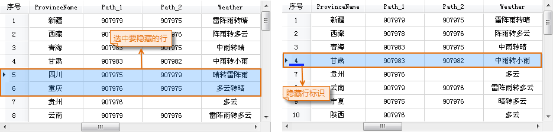
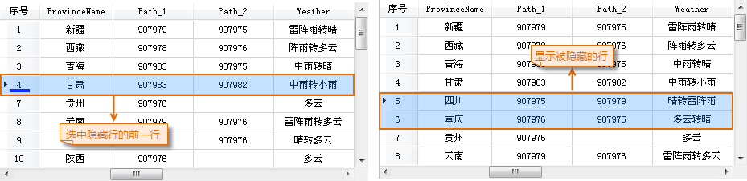

### 隐藏行

“隐藏行”选项用来隐藏属性表中选中的行。

**操作步骤**

1. 在打开的属性表中，选中需要隐藏的一个或多个行，可配合使用 Shift 或 Ctrl 键选中多条记录。
2. 单击 **属性表** 选项卡-> **编辑** -> **隐藏行** 按钮，或单击右键选择“ **隐藏行** ”选项。
3. 选中的行将不再显示在属性表窗口中，同时在被隐藏行的前一行记录会被整行选中，且该行记录下方会显示隐藏行的标志。  

  

**注意事项**

1. 只有在当前属性表中有选中的行时，“隐藏行”按钮才可用。
2. 隐藏行操作并不会删除被隐藏的属性行，只是让某些行暂时不可视，可以使用“取消行隐藏”按钮显示隐藏的属性行。
3. 关闭属性表后再次打开，将不会保留前一次的隐藏行或隐藏列操作，会显示属性表中所有的行、列信息。

### 取消行隐藏

“取消行隐藏”选项，用来显示属性表中被隐藏的行。 只有在当前属性表中有选中的行时，“取消行隐藏”选项才可用。

**功能入口**

* 打开有隐藏行的属性表，单击 **属性表** 选项卡-> **浏览** -> **取消行隐藏** 按钮，即可显示所有隐藏行。 
* 在属性表中单击右键，选择“ **取消行隐藏** ”选项，即可显示所有隐藏列。

若当前属性表中无可选择的列，则说明所有属性列都被隐藏，则单击“取消行隐藏”按钮后，显示所有隐藏列。

* 隐藏行标志对应的隐藏行显示后，隐藏标志消失。  

  

 [升序](SortOrderAscendingButton)

 [降序](SortOrderDescendingButton)

 [隐藏列](HideButton)

 [取消列隐藏](CancelHideButton)

 [取消行隐藏](CancelHideRows)

 [筛选](FilterButton)

 [定位](GoToButton)

 [显示十六进制](DisplayHexadecimal)

