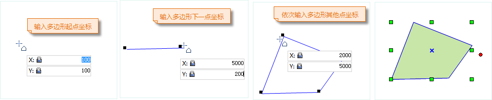
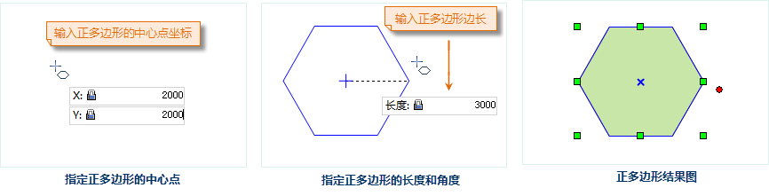

---
id: DrawPolygon
title: 绘制多边形  
---  
### 使用说明

“多边形”命令用来创建一个多边形。这里说的多边形包括任意多边形、正多边形、正交多边形等。多边形是我们最常用的面对象的一种，常常用多边形来表现封闭的面状地物，如行政区、土壤、植被、湖泊等。它还可以表现地理上一些特殊的面状地物类型，如岛、环、飞地等。

### 操作步骤

**通过输入坐标值绘制多边形**

1. 在“ **对象操作** ”选项卡的“ **对象绘制** ”组中，单击“ **面** ”下拉按钮，选择“ **任意多边形** ”选项，出现多边形光标。
2. 将鼠标移动到地图窗口中，可以看到随着鼠标的移动，其后的参数输入框会实时显示该点的坐标值。在该参数输入框中输入多边形的一个节点的坐标值（可以通过按 Tab 键，在两个参数输入框间切换）后，按 Enter 键，确定多边形的起始位置。
3. 再次移动鼠标并在其后的参数输入框中输入多边形上第二个点的坐标值，按 Enter 键，绘制多边形上的第一段线。
4. 输入下一节点的坐标值，按 Enter 键，绘制多边形的下一段线。
5. 继续顺次输入其它节点的坐标值，绘制多边形上的其它线段。
6. 单击鼠标右键，闭合多边形，结束当前绘制操作。 

注意：当用户编辑参数输入框中的数值时，该输入框将处于锁定状态，即参数输入框中的数值不随鼠标的移动而变化，只显示用户输入的数值；按 Tab 键可以在 X、Y
坐标输入框之间切换焦点，即编辑状态。按住 Esc 键可以取消当前参数输入框的锁定状态。

绘制多边形的过程如下图所示：

**通过长度、角度绘制多边形**

1. 在“ **对象操作** ”选项卡的“ **对象绘制** ”组中，单击“ **面** ”下拉按钮，选择“ **多边形(长度、角度)** ”选项。
2. 将鼠标移动到地图窗口中，可以看到随着鼠标的移动，其后的参数框中会实时显示该点的坐标值。在框中输入多边形上第一个节点的坐标值（可以通过按 Tab 键，在两个参数输入框间切换）后按 Enter 键，确定多边形的起始位置。
3. 移动鼠标，可以看到随着鼠标的移动，在地图窗口中会实时显示鼠标位置与上一个控制点连线的长度及其与 X 轴正向之间的夹角，在参数输入框中键入长度值和角度值（可以通过按 Tab 键，在两个参数输入框间切换），按 Enter 键执行输入，确定多边形的第一段线的绘制。
4. 输入下一节点与上一个节点与其上一个节点之间的距离（长度）及其连线与 X 轴正向之间的夹角（可以通过按 Tab 键，在两个参数输入框间切换），按 Enter 键，绘制多边形的下一段线。
5. 重复上述步骤，继续绘制多边形其它线段。
6. 单击鼠标右键结束当前绘制操作。

**绘制正多边形**

1. 在“ **对象操作** ”选项卡的“ **对象绘制** ”组中，单击“ **多边形** ”下拉按钮，选择“ **正多边形** ”选项。
2. 弹出“参数设置”对话框，在对话框中输入要绘制的正多边形的边数。要求输入的正多边形的边数大于3。默认的边数为5。
3. 将鼠标移动到地图窗口中，可以看到随着鼠标的移动，其后的参数框中会实时显示鼠标位置的坐标值。在框中输入正多边形中心点的坐标值（可以通过按 Tab 键，在两个参数输入框间切换）后，按 Enter 键确认。
4. 再次移动鼠标并在其后的参数输入框中输入正多边形外接圆的半径（长度），以及正多边形外接圆半径与水平轴方向的夹角（角度），按 Enter 键，完成正多边形的绘制。

正多边形的绘制过程如下图所示：

 

