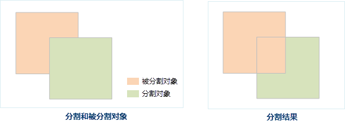

---
id: CutByChoosePolygon
title: 选择对象分割  
---  
### 使用说明

“选择对象分割”通过选择的对象来分割线或者面对象。

只有当前地图窗口中有可编辑的图层，且图层中存在一个或多个选中的线或面对象时，“对象分割”按钮才可用。

 

### 操作步骤

1. 将地图窗口中要进行分割的线或者面几何对象所在的图层设置为可编辑状态。
2. 选中可编辑图层中的线或面几何对象，在“ **对象操作** ”选项卡的“ **对象编辑** ”组的 Gallery 控件中，单击“ **选择对象分割** ”按钮，执行选择对象分割操作。
3. 此时，将鼠标移到当前地图窗口中，鼠标提示“请选择分割对象”，选择一个线对象或面对象作为分割对象，即根据两个对象相交处，将被分割对象进行分割。

###  注意事项

* 当启动了多图层编辑时，用户可以同时分割多个可编辑图层中的线或者面几何对象。

