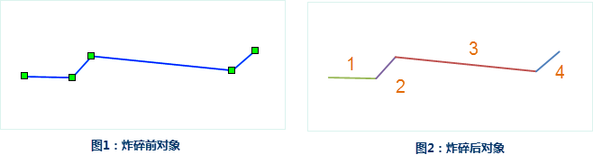

---
id: Explode
title: 炸碎  
---  
使用炸碎功能，可以将选中的单个或者多个线对象分解为最小单位的直线对象。

最小单位的直线对象表示该对象有且仅有两个节点即两个端点，且为简单对象。

如下图所示，待炸碎的对象共有5个节点（图1）；炸碎后该对象分解为4个对象，且每段对象仅包含2个节点。图2所示为对炸碎后的多个对象按照 SMID制作单值专题图的结果。

 
  
### 使用说明

  * 炸碎功能适用于二维线图层以及 CAD 图层，该功能在图层可编辑且有线对象被选中的情况下可用。
  * 复杂对象也同样适用于炸碎操作。炸碎后的复杂对象将被分解，同时每一个子对象被分解为最小单位的直线。

### 操作步骤

  1. 在图层可编辑状态下，选择一个或多个要炸碎的线对象。 
  2. 在“ **对象操作** ”选项卡的“ **对象编辑** ”组的 Gallery 控件中，单击“ **炸碎** ”按钮，执行炸碎操作。
  3. 炸碎操作完成后，会在输出窗口中提示炸碎后生成多少个对象。例如：线对象[smID]=221被炸碎共产生4个对象！

###  备注

对于圆弧、圆等节点较多的对象，炸碎后由于新生成的对象每一段比较碎小，在小比例尺下不会显示。应用程序对一些小对象进行过滤显示，对于长度小于0.4mm
的线对象，不予显示。有关对象最小尺寸的内容，请参见 **地图显示优化**
的[对象尺寸过滤显示](../../../Optimization/MapOptimization/MapOptimization)部分。

