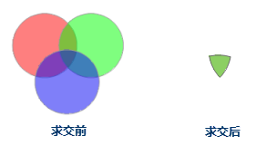

---
id: Intersect
title: 求交  
---  
求交操作可以得到两个或多个对象的公共部分。通过求交运算，对两个或者多个相同几何类型的对象的公共区域进行操作，从而创建一个新的对象。多个对象的公共区域被保留下来，其余部分被删除。需要注意的是，线线之间不支持求交运算。

### 使用说明

  * 如果参与对象运算的面两两交集不为空集，则求交之后，会生成一个两两相交部分的简单对象。  
    
  

  * 如参与对象运算的面两两交集为空，则求交之后，所有源对象都会被删除掉，且不会生成一个新的对象。   
     

  
如上图所示，参与运算的面两两交集为空，求交后源对象将被删除。

  * 生成的新对象的属性说明。需要在属性对话框中设置保留那个对象的属性信息，以及对字段值进行什么样的操作。关于对象求交属性处理对话框及对话框上各参数的说明，请参见[属性处理对话框说明](AttributeDiag)。
  * 在 CAD 图层中，面对象、矩形对象、圆对象、斜椭圆对象对象参与运算后，生成的新对象的类型为面对象。
  * 跨图层求交。其他图层的选中的对象都会与当前可编辑图层中的对象进行求交运算，操作后只有当前可编辑图层的对象发生改变，其他图层的对象不会发生变化。对于多图层编辑，也指定的可编辑图层中的对象进行求交操作。

### 操作步骤

  1. 在图层可编辑状态下，选中两个或者多个对象。
  2. 在“ **对象操作** ”选项卡的“ **对象编辑** ”组的 Gallery 控件中，单击“ **对象运算** ”分组中的“ **求交** ”按钮，弹出“求交”对话框。
  3. 在对话框中，设置要保留的对象。关于对象求交属性处理对话框及对话框上各参数的说明，请参见[属性处理对话框说明](AttributeDiag)。

