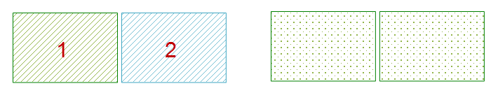
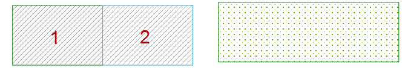
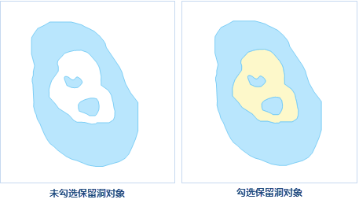

---
id: PolygonWithHole
title: 岛洞多边形  
---  
岛洞多边形是一种复杂几何对象类型。在可编辑状态下，将两个或两个以上具有包含关系的面对象在重合区域进行处理（删除或者保留，面对象为偶数则重合部分将删除，为基数则保留），最终形成一个岛洞多边形。如一个区域内有湖泊时，就会得到一个岛洞多边形。

### 使用说明

  * 岛洞多边形使用于面图层或者 CAD 图层。
  * 选择两个或两个以上的面对象，进行岛洞多边形操作，会有以下几种情况：
    * 如果选择的面对象互不相交，则会生成一个复杂对象。 
    
 

  * 如果选择的面对象相交于点或线，则这些面对象被合并成一个复杂对象。  

     

  * 如果选择的面对象相交于面但不重合，当面对象个数为奇数时，面对象相交部分被保留，结果得到一个复杂对象；当面对象个数为偶数时，面对象相交部分被删除，结果得到一个复杂对象。
    
  ---  
  保留奇数面，删除偶数面  
  * 如果选择的面对象完全重合，当重合个数为奇数，结果会得到一个面对象；当面对象个数为偶数时，所有面对象将被删除。

三个重合的圆进行岛洞多边形的操作，最终得到一个圆对象；两个重合的圆进行岛洞多边形的操作，得到的结果为空。

### 操作步骤

  1. 在图层可编辑状态下，选择一个或多个面对象。 
  2. 在“ **对象操作** ”选项卡的“ **对象编辑** ”组的 Gallery 控件中，单击“ **岛洞多边形** ”按钮，弹出“ **岛洞多边形** ”对话框。

在“岛洞多边形”对话框中，既可以为每个字段分别设置操作方式，也可以同时选中多个字段统一进行设置。下面是对该对话框的说明。

  * **可编辑图层：** 可编辑图层下拉列表中列出了当前地图中所有的可编辑图层。可通过单击其右侧的下拉箭头，选择要操作的图层。
  * **字段列表区** ：该区域列出了当前可编辑图层中所有非系统字段和可编辑的系统字段的信息，包括字段名称、字段类型以及连接操作完成后，新对象字段的操作方式。默认使用第一个对象的字段属性。
  * **操作方式设置区** ：提供了四种操作方式。 
    * **为空** ：指完成操作后新对象此字段的值为空。
    * **求和** :指完成操作后新对象此字段的值为各个源操作对象相应字段值的和。
    * **加权平均** ：指操作完成后新对象此字段的值为所有源对象此字段的加权平均值。需要指定加权字段。若不选择加权字段，则计算其简单的平均值，就是将所有源对象的选中字段值相加然后除以源对象的个数。
    * **保存对象** ：指操作完成后新对象此字段的值与当前某一个选择对象的此字段值相同。可以单击右侧的下拉箭头，选择新对象要使用的对象属性值。
  * **保留洞对象** ：勾选改复选框，即可将导洞多边形操作结果中的洞区，单独保存为一个面对象，便于用户对该对象进行其他操作和设置。如下图所示，未勾选改复选框则洞区无对象，为空白显示（左图）；勾选“保留洞对象”复选框之后，结果中的洞区会保存为一个面对象（右图），便于用户对其设置风格、属性等。    
   
       

  3. 单击“确定”按钮，完成岛洞多边形操作。

