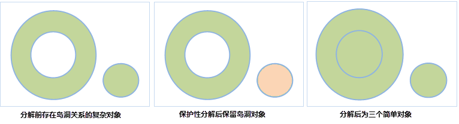

---
id: ProtectedDecompose
title: 保护性分解  
---  
保护性分解将复杂的具有多层岛洞嵌套关系的面对象分解成只有一层岛洞嵌套关系的面对象。保护性分解与分解的区别在于：如果被分解的面对象存在岛洞关系，保护性分解后的结果会保留最简单一层的岛洞关系面对象，而分解会将岛洞关系的面对象一并分解。

### 使用说明

  * 保护性分解功能适用于面图层、CAD 图层。
  * 只能对复杂对象或者复合对象进行分解，简单对象不能被分解。
  * 对复杂对象（即含有多个子对象的对象）进行分解，生成的多个单一对象均为简单对象（除岛洞对象外）；对复合对象进行分解，生成多个单一对象，除岛洞对象外，如果生成的单一对象中仍有复合对象则可以继续对其进行分解，直至全为简单对象。 

如下图所示为一个岛洞对象与另一个对象组合，对它进行保护性分解操作之后，得到的新对象为一个岛洞对象和一个单一对象：

  

  * 生成的新对象的属性信息中字段 SmUserID 和非系统字段继承源对象相应信息，其他系统字段由系统赋值。

### 操作步骤

  1. 在图层可编辑状态下，选中一个或多个复杂对象或复合对象。
  2. 在“ **对象操作** ”选项卡上的“ **对象编辑** ”组的 Gallery 控件中，单击“ **保护性分解** ”按钮，执行保护性分解操作。 

