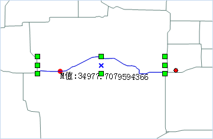
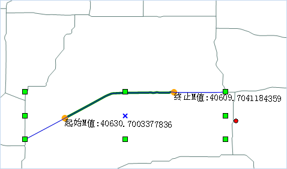
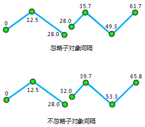

---
id: RouteAddNode
title: 路由对象编辑  
---  
 ### 根据M值添加点/高亮线段

 “根据M值添加点/高亮线段”功能，可为选中路由线对象添加一个特定M值的节点；同时可根据起始和终止M值，在图层上高亮显示两个M值之间的路由线段。

 **操作步骤**

   1. 将路由数据添加到地图窗口中，将该图层设置为可编辑状态，选中一个需添加点的路由对象。

   2. 在“ **对象操作** ”选项卡的“ **对象编辑** ”组的 Gallery 控件中，单击“ **根据M值添加点/高亮线段**
”按钮，弹出“根据M值添加点/高亮线段”窗口。

   3. 勾选“添加点”复选框，可在路由线对象上添加指定M值的节点，添加方式有以下两种：

  * 在编辑框中输入一个M值，例如输入100，则该路由线M值为100处的点将在地图上高亮显示，单击“添加”按钮，则在该路由线对象上增加一个M值为100的节点。

  * 单击“M值”组合框右侧的“拾取”按钮，将鼠标移至选中的路由对象处，会显示鼠标所在位置的M值和坐标信息，在合适位置单击鼠标后，单击对话框中的“添加”按钮，即可将该点添加到选中的路由对象上。

   

   4. 勾选“高亮线”复选框，在起始M值和终止M值数值框中输入M值，或者单击“拾取”按钮，在地图窗口选中的路由线对象上拾取合适的M值位置，分别作为起始M值和终止M值，则位于这两个M值之间的路由线段会在地图中高亮显示。如下图所示：

   
 
   5. 单击“关闭”按钮，将当前对话框关闭，完成添加点或高亮线的显示。

 ###  注意事项

 添加点处输入的M值必须在选中路由对象的最小、最大M值之间；高亮线处的起始M值和终止M值的值域，为选中路由对象的最小M值至最大M值。

 ### 校正路由对象M值

 路由对象是一组具有X，Y坐标与线性度量值（M
值）的点组成的线性地物对象。比如高速公路上的里程碑，交通管制部门经常使用高速公路上的里程碑来标注并管理高速公路的路况、车辆的行驶限速和高速事故点等。路由对象M校正是调整路由测量值，使其与已知的参考点保持一致的过程。有关校正路由的更多内容，请参阅[校准路由概述](../../../DynamicSeg/AboutCalibrate)。
 **操作步骤**
   1. 将路由数据添加到地图窗口中，并将该图层设置为可编辑状态，并选中一个需进行 M 值校准的路由对象。
   2. 在“ **对象操作** ”选项卡的“ **对象编辑** ”组的 Gallery 控件中，单击“ **M值校准**
”按钮，弹出“路由对象M值校正”窗口。
   3. 对话框的列表处显示了路由对象的坐标和M值，用户可勾选路由节点作为M值校正的参考点，选中的路由对象节点，会在地图窗口中高亮显示，且可在列表中直接修改参考点的M值。
   4. 在参数设置处设置校正方式，校正方式分为：按距离校准和按刻度值校准两种。有关这两种校准方式的介绍，请参见[校准路由概述](../../../DynamicSeg/AboutCalibrate)相关内容的介绍。

    * **按距离校准** ：根据参考点基于两点间的沿路由的距离来计算 M 值。

    * **按刻度值校准**：利用参考点对应路由上位置的刻度值来进行校准。当被校准的路由的长度与刻度值的比值不一致时，这种方法非常适用于对路由的刻度值进行微调。

   5. **忽略子对象空隙：**
设置是否忽略子对象之间的间隔。默认忽略子对象之间的间隔。路由可以是包含多个子对象的复杂对象。当两个子对象不连续时，就会产生间隔。是否忽略子对象的间隔影响着路由刻度值的连续性，如果忽略子对象的间隔，刻度值将是连续的，否则就是不连续的，此时子对象的间隔的距离就是两个端点的直线距离。
 如下图所示，忽略子对象间隔时，第一个子对象的终点的 M 值和第二个子对象起点的 M 值相同；不忽略子对象间隔时，第二个子对象的起点的 M值就是第一个子对象的终点 M 值加上两者的间隔的直线距离   

   

   6. 设置好以上参数之后，单击“校正”按钮，执行该操作。

 ###  注意事项

   1. 用于校准路由的参考点至少为2个，建议采用离待校准节点最近的两个参考点来校准。

   2. 若参考点的M值为无值即-9999，则路由对象M值校正会失败。

 ### 删除所有M值

 用于删除选中的一个或多个路由对象的所有M值，删除M值后，路由对象的M值会变成-9999。

 **操作步骤**

   1. 将路由数据添加到地图窗口中，并将该图层设置为可编辑状态，选中一个或多个需删除 M 值的路由对象。

   2. 在" **对象操作** "选项卡上的“ **对象编辑** ”组的 Gallery 控件中，单击“ **删除所有M值**
”按钮，即可将路由对象的所有M值都删除。

   3. 此时查看路由对象属性时，可发现 M 值已更新为-9999。

 ###  相关主题

 [校准路由概述](../../../DynamicSeg/AboutCalibrate)

 [校准路由](../../../DynamicSeg/CalibrateRoute)

  [校正路由对象M值](CalibrateRouteM)

  

