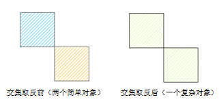
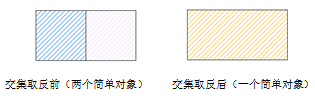
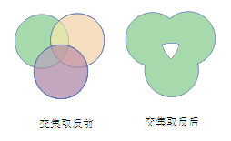
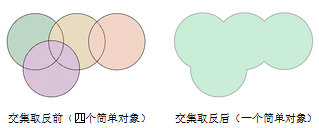
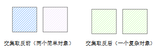

---
id: XOr
title: 异或  
---  
将两个或多个对象的共有部分除去，其余部分合并成一个对象。

### 使用说明

在进行异或操作时，会出现多种情况，下面对这些情况分别进行说明。

* 如果参与运算的对象仅相交于点，则这些面对象被合并成一个复杂对象（如下图生成一个具有两个子对象的复杂面对象）。  

  
---  
* 如果参与运算的对象仅相交于线，则这些对象间的相邻边线将消失，合并成一个简单对象。   
  
     
---  
* 如果参与运算的对象两两相交于面且不重合，则两两相交部分会被删除，然后合并成一个复杂对象（如下图生成一个具有两个子对象的复杂面对象）。
  
    
---  
* 如果参与运算对象续相交于面，且无两两相交部分（即公共相交部分），则参与运算的对象会合并成一个简单面对象。
  
    
---  
* 如果参与运算的对象相互重合，参与运算的对象全被删除。

* 如果参与运算对象互不相交，则会生成一个复杂对象（如下图生成一个具有两个子对象的复杂面对象）。  
    
---  

### 操作步骤

1. 在图层可编辑状态下，选中两个或者多个对象。

2. 在“ **对象操作** ”选项卡的“ **对象编辑** ”组的 Gallery 控件中，单击“ **异或**
”按钮，弹出“异或”对话框。

3.
在对话框中，设置要保留的对象。关于对象异或操作后属性处理对话框及对话框上各参数的说明，请参见[属性处理对话框说明](AttributeDiag)。

4. 单击“确定”按钮，完成对象的异或操作。

