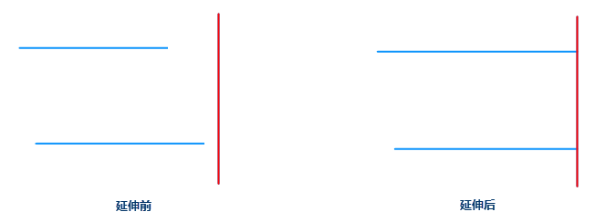

---
id: extend
title: 延伸  
---  
延伸功能用将两条或者多条不相交的线对象进行延伸，保证它们最终能够相交。

### 使用说明

  * 在图层可编辑状态下，将选中的线对象（或者 CAD 图层的线对象）延伸到指定对象（基线）。
  * 在选择延伸线对象时，需要单击选中延伸线上靠近基线方向的位置，
  * 在延伸状态下，如果已经选择一个线对象作为基线，那么只能连续将不同的其他线对象延伸到该基线。
  * 延伸操作只对延伸后会与基线相交的线对象有效，而对于不会相交的线对象将不进行任何操作。
  * 在线图层中，基线可以是任意类型的线对象，如直线、平行线、圆等，也可以是复杂线对象。在待延伸的线可以是任意不封闭的简单线对象，如直线，折线，弧段，多段线等，需要说明的是平行线是有两个子对象的复杂对象。
  * 在 CAD 图层中，基准线和待延伸的线均必须是对象类型为线的线对象。对象类型可通过对象属性的空间信息进行查看。

### 操作步骤

  1. 在“ **对象操作** ”选项卡的“ **对象编辑** ”组的 Gallery 控件中，单击“ **延伸** ”按钮，执行延伸操作。此时在地图窗口中提示：请选择基线。
  2. 选择一个线对象作为基线，地图窗口会提示：请点击要延伸的线。
  3. 单击需要延伸的线对象，一定要选择该线对象的靠近基线方向的位置，则应用程序会自动延伸距离基线近的端点到基线位置。如果单击改线对象上远离基线方向的端点位置时，不会进行延伸。
  4. 如果需要将其他的线对象延伸到该基线，继续单击要延伸的线对象即可。
  5. 要结束此操作，可以通过按键盘 ESC 键结束。 

或执行下列操作：

单击鼠标右键结束。

 

### 注意事项

当要延伸的线，其延长线不与基线相交时，不能对其进行延伸操作。

