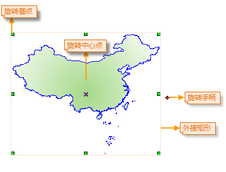
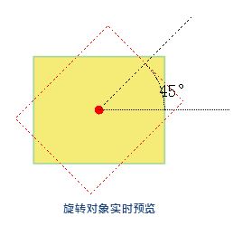

---
id: rotate
title: 旋转  
---  
 在图层可编辑状态下，对选中对象进行旋转操作。

 ### 使用说明

   * **旋转基点与旋转中心点**

 旋转基点是几何对象范围的外接矩形左上角的角点，旋转中心点位于几何对象的内部（X
状，如下图所示），在对几何对象进行旋转时，旋转基点保持不变，几何对象绕旋转中心点按照指定的角度进行旋转。
 当一次选中多个对象时，旋转基点为这几个对象共同的外接矩形左上角的角点位置。  

   

   * SuperMap 支持对点图层、线图层、面图层、文本图层、CAD 图层、路由图层中的对象进行旋转。

   * 在进行旋转时，既可以通过拖动旋转的方式，将对象旋转至目标位置，也可以通过手动输入旋转角度的方式，对几何对象进行精确旋转。

 ### 操作步骤
 **拖动旋转**
   1. 在可编辑图层中选择一个或多个对象。

   2. 将鼠标放置在旋转手柄上，当鼠标状态变为可旋转状态时，按住鼠标左键，拖动对象至欲旋转的位置松开鼠标左键即可。

 **精确旋转**

   1. 在可编辑图层中选择一个或多个对象。

   2. 在“ **对象操作** ”选项卡的“ **对象编辑** ”组的 Gallery 控件中，单击“ **旋转**
”按钮，弹出“对象旋转参数设置”对话框。

   3. 旋转中心点列出了该点的(X,Y)坐标值。默认的选择中心点为几何对象的外接矩形左上角的锚点。用户可以通过修改(X,Y)坐标，设定新的旋转基点。

   
  
   4. 在旋转角度编辑框中键入旋转角度。正值表示对象按逆时针方向进行旋转，负值表示对象按顺时针方向进行旋转。键入角度后地图窗口中会实时显示旋转后对象的预览图（用虚线表示）。

   5. 单击“确定”按钮，对选中的几何对象进行旋转。

  

