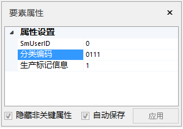
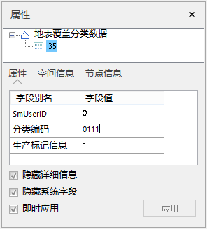
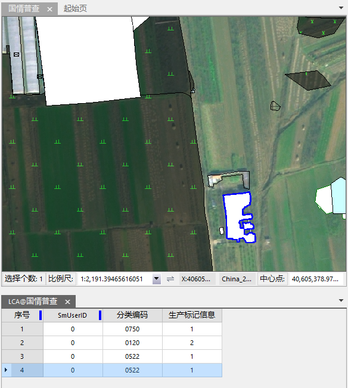

---
id: SymbolicMappingPropertySettings
title: 符号化制图属性编辑  
---  
 支持编辑数据集的属性字段信息，且提供了多种方式的属性录入方式，供用户灵活选择使用。
 ### 编辑数据集的属性字段

按照符号化制图模板，数据集依照模板创建了固定的属性字段。通过单击某数据集右键，选择“属性”项，弹出“属性”对话框，用户可查看数据集属性字段。也支持用户对这些字段进行添加、修改、删除等操作。详情请参考[矢量数据集属性窗口](../../DataManagement/DTgroupDiaVector#222)。

 ### 编辑数据集的属性字段值

 在“符号化制图“功能界面中，单击选择某个具体要素绘制完成后，会自动填充该要素对应的基本信息，其他属性信息需要用户手动输入。具体填写属性几种方式如下：

1. 在工作空间右侧的**要素属性**窗口中，可编辑或者输入其他属性信息。

   

2. 用户可双击某对象要素，或通过右键的“属性”项，打开对象要素的属性信息，可直接在“属性”窗口中，编辑字段信息。在对象属性窗口中，除了属性字段信息外，还可以查看空间信息和节点信息。详情请参考[查看和修改几何对象的属性](../../../Visualization/Interaction/Geometry_Property)。

   
 
3. 用户可通过“属性刷”的方式，实现对象属性信息的快速赋值。例如，可先对某一对象进行赋值，再使用属性刷对属性值相同的对象要素统一赋值，具体操作方式可参照[属性刷](../../Objects/EditObjects/PropertyBrush)。
4. 用户可通过批量赋值的方式修改对象要素属性，按住shift在地图中选择多个对象要素，并在要素“属性”对话框中输入或选择属性值，即可实现对象属性信息的批量修改。

也可以在选中多个属性对话框后，使用右键菜单中的“关联浏览属性”功能。该功能将结合属性表，以属性表记录集的方式显示多个对象的属性，关联浏览支持地图对象与记录集的联动显示，方便用户进行对应属性信息的修改。如下图所示:

   

  
 ###  相关主题

  [符号化制图概述](SymbolicDrawing)

  [符号化制图实例](SymbolicMappingExample)

