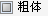

---
id: SameTypeTextStyle
title: 同类文本风格  
---  
### 使用说明

“同类文本风格...”功能可对同类风格文本进行批量风格设置，统一替换文本风格。

### 操作步骤

1. 在地图窗口中打开文本图层，并文本图层设置为可编辑状态。

2. 在地图窗口中选中一个文本对象，单击鼠标右键，在弹出的右键菜单中选择“同类文本风格...”，弹出“同类文本风格”对话框。
3. “同类文本风格”对话框中的参数分为“筛选同类文本风格”和“设置目标文本风格”两大类，左侧参数用于设置待修改风格的同类文本风格，右侧用于设置目标文本风格。

**筛选同类文本风格**

确定将当前文本图层中的文本对象设为同一类文本的风格标准。该区域的所有参数均为“与”的关系，即如果同时选择多个标准，则当前文本图层中同时满足多个标准的文本为同类文本。未勾选复选框的参数表示不考虑，不作为同类文本标准。该区域的默认参数与选中的文本对象风格一致。

* **字体名称**
：单击右侧下拉按钮，可从中选择某一种字体作为同类文本的标准，例如选择“宋体”，则当前文本图层中的所有满足其他条件宋体文本对象为同类文本。注意：可通过键盘输入字母快速定位字体。

* **对齐方式**
：单击右侧下拉按钮，可从中选择某一种对齐方式作为同类文本的标准，例如选择“左上角”，则当前文本图层中所有满足其他条件的对齐方式为左上角的文本对象为同类文本。

* **字号**
：在组合控件中选择或直接输入字号大小，作为同类文本的标准。例如选择或输入字号为“10.5”且不改变字高和字宽值，则当前文本图层中同时满足其他标准的所有字号为10.5的文本为同类文本。

* **字高**
：仅当勾选“字号”复选框后才可设置字高。可通过字号来获得字高值，也可直接是输入字高值，此时系统会自动推算出字号大小，但字宽值不发生变化。

* **字宽** ：直接输入字宽值作为字宽同的标准，例如输入字宽为19，则当前文本图层中满足其他条件且字宽为19的所有文本为同类文本。

* **旋转角度**
：从中选择或直接输入角度值作为旋转角度相同的标准，单位为度，例如选择或输入角度为“45”，则当前文本图层中符合其他标准且旋转角度为45°的所有文本为同类文本。应用程序提供了
0，45，90，135，180，225，270，315 共 8
种常用的角度值。也可以直接输入任意角度值，系统将会把输入值换算至0-360之间，如-180，720被换算为180和0。

* 前景色/背景色：单击颜色控件，在弹出的颜色面板中选择文本前景色或背景色，例如在前景色中选择为“自动（黑）”，则当前文本图层中满足其他条件的所有前景色为自动（黑）的文本为同类文本。

* 字体效果：字体效果包括：粗体、斜体、轮廓、阴影、下划线、删除线、背景透明、固定大小，其复选框可为三种形态，即勾选、不勾选、三态，下面以粗体为例进行说明：

 ：复选框为不选中状态，表示当前文本图层中字体效果不是粗体的文本对象为同类文本标准之一。

 ：复选框为三态，表示不考虑文本对象是否为粗体，即是否为粗体不作为同类文本标准。

 ：复选框为选中状态，表示字当前文本图层中字体效果为粗体的文本对象为同类文本标准之一。

**设置目标文本风格** ：该区域可设置当前图层中同类文本对象的目标风格，可设置的参数与“筛选同类文本风格”区域参数一一对应。

除字体效果外的参数复选框有勾选和不勾选两种状态，具体说明如下：

* 勾选：勾选字体风格参数复选框，即可设置文本对象的目标风格，表示修改指定文本对象字体风格。

* 不勾选：不勾选字体风格参数复选框，表示该项字体风格保持不变。

字体效果的参数复选框有勾选、三态、不勾选三种状态，下面以“粗体”复选框的三种状态为例，说明三种状态：

  ：复选框为不勾选状态，表示设置同类文本字体的目标效果为不加粗。  
  ：复选框为三态，表示保持原文本对象的风格，该选项风格不发生变化，默认为三态。  
 
  ：复选框为选中状态，表示设置同类文本的目标字体效果为粗体。

4. 设置好以上参数后，单击“确定”按钮，即可完成同类文本风格替换操作。

 注意事项

“同类文本标准”区域中各选项之间是并列的关系。即如果同时选中了“字体名称相同：宋体”、“均有删除线”，则代表在文本图层中文本对象字体为宋体并且具有删除线的对象才会被赋予目标文本风格区域中设置的风格。

