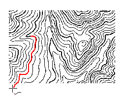
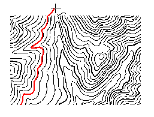
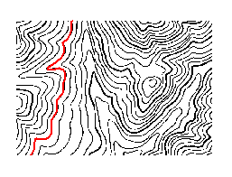

---
id: AboutTrace
title: 交互式半自动化栅格矢量化  
---  
在使用此功能前，需要了解以下几个问题：

* 什么是栅格矢量化？

将栅格数据转化为矢量数据的过程称为栅格矢量化。

* 为什么要进行交互式半自动栅格矢量化？

矢量数据相对于栅格数据而言具有数据结构紧凑、冗余度低，有利于网络和检索分析，图形显示质量好、精度高等优点，在进行一些应用分析时需要对栅格数据进行矢量化。

目前，桌面支持半自动栅格矢量化功能。提供了栅格矢量化线、矢量化面、矢量化线回退等相关的操作，在进行半自动矢量化过程中，可以辅助用户更好地完成栅格矢量化工作。

### 栅格矢量化设置

开始进行半自动栅格矢量化，需要先做一些准备工作：首先至少存在一个配准好的栅格底图，其次要有一个用于绘制矢量线或者面的数据集。然后栅格底图和线/面数据叠加与同一个窗口中显示，且矢量数据集处于可编辑状态，栅格矢量化功能才可用。

在进行半自动栅格矢量化前，需要对栅格矢量化的参数进行设置。

**操作步骤**

1. 在“ **对象操作** ”选项卡的“ **栅格矢量化** ”组中，单击“ **设置** ”按钮，弹出“ **栅格矢量化** ”对话框。

或执行以下操作，也可完成相关设置：若当前地图窗口中，存在一个影像图层以及可编辑的线、面或者 CAD
图层时，矢量化线、矢量化面功能可用，单击“矢量化线”或“矢量化面”按钮，会自动弹出“栅格矢量化”对话框。

2. 在该对话框中，对栅格矢量化的参数进行设置，参数如下：

* **栅格地图图层** ：设置用于栅格矢量化的栅格底图。当存在多个栅格图片时，可以通过下拉箭头切换需要矢量化的栅格图层。

* **背景色** ：设置栅格地图的背景色。在栅格矢量化过程中，将不会追踪栅格地图的背景色。默认背景色为白色。

* **颜色容限** ：栅格底图的颜色相似程度，在矢量化过程中，只要 RGB
颜色任一分量的误差在此容限内，则应用程序认为可以沿此颜色方向继续进行矢量化。取值范围为[0-255]，默认值为32。

* **过滤像素数**
：设置去锯齿过滤参数，即光栅法消除线对象锯齿抖动的垂直偏移距离（单位为图像像素），默认值为0.7。去锯齿过滤参数越大，过滤掉的点越多。

* **光滑系数** ：将栅格矢量化时，需要进行光滑处理。设置的光滑系数越大，则结果矢量线/面的边界的光滑度越高。

* **自动移动地图**：如果处于选中状态，则表示自动移动地图。当矢量化至地图窗口边界上时，窗口会自动移动；反之，则表示需要手动移动地图。应用程序默认为选中状态。

3. 设置完成后，单击“确定”按钮，完成设置并退出该对话框；否则，将取消所有参数设置，并退出该对话框。

**注意** ：用户在“栅格矢量化”窗口中所做的相关设置会自动保存，下次打开“栅格矢量化”窗口，可以基于上次设置的参数进行修改。

### 矢量化线

通过多次人机交互，对栅格底图中的线进行矢量化。

**操作步骤**

1. 在“ **对象操作** ”选项卡的“ **栅格矢量化** ”组中，单击“ **矢量化线** ”按钮，会自动弹出“ **栅格矢量化**
”对话框，需要对矢量化的相关参数进行设置。如果已经完成了设置，直接单击“确定”按钮，进行矢量化操作。

2. 将鼠标移至需要矢量化的线上，单击鼠标左键开始矢量化该线对象。

3. 矢量化至断点或者交叉口，矢量化会停下来，等待下一次矢量化操作。此时跨过断点或者交叉口，在前进方向的底图线上双击鼠标左键，矢量化过程会继续，直到再次遇到断点或交叉口处停止。

4. 遇到线段端点，单击鼠标右键进行反向追踪。

5. 重复第三步，直到完成一条线的矢量化操作。

6. 再次单击鼠标右键结束矢量化操作。如果曲线是闭合的，则矢量化过程中会自动闭合该线，并结束此次矢量化操作。

* **矢量化操作图示说明**

说明|示意图  
---|---  
1：移动鼠标到需要跟踪的图像线上，单击鼠标左键开始绘制该图像线。遇到线段端点，停止绘制。在前进方向的底图线上双击鼠标左键，矢量化过程会继续。 |  
2：单击鼠标右键进行反向矢量化绘制，遇到另一个端点，矢量化绘制结束。|  
3：再次单击鼠标右键退出当前矢量化绘制，得到一个线对象。|       

* 在矢量化跟踪过程中，由于栅格底图原因，可能对某些矢量化效果不太满意，可以点击“矢量化线回退”按钮，回退一部分线，单击鼠标左键确定，或单击右键，回到当前矢量化绘制状态。

* 如果栅格底图中线的大小不合适，可用“放大”、“缩小”等功能调整图像大小，以便能看清线的细节，然后单击鼠标右键，回到矢量化绘制状态。

* 在矢量化绘制过程中，单击 Esc 键或者在“栅格矢量化”组中单击“矢量化线”功能按钮，即可取消当前的绘制。

* 通过 Alt + Q 快捷键，可以快速便捷地使用矢量化线功能。

### 矢量化线回退

在不结束矢量化绘制过程的情况下，绘制状态回退到之前绘制过的位置。

**操作步骤**

1. 在“ **对象操作** ”选项卡的“ **栅格矢量化** ”组中，单击“ **线回退** ”按钮。

2. 移动鼠标到需要回退的位置，单击鼠标左键确定，回退鼠标当前所在的位置。

3. 单击鼠标右键，取消回退操作，回到矢量化绘制状态，继续进行矢量化的操作。

**注**

* 只有正在执行矢量化线操作时，矢量化线回退功能才可用。

* 通过 Alt + Z 快捷键，可以快速便捷地使用矢量化线回退功能。

### 矢量化面

对栅格底图中的面进行半自动矢量化。

**操作步骤**

1. 在“ **对象操作** ”选项卡的“ **栅格矢量化** ”组中，单击“ **矢量化面** ”按钮，会自动弹出“ **栅格矢量化**
”对话框，需要对矢量化的相关参数进行设置。如果已经完成了设置，直接单击“确定”按钮，进行矢量化操作。关于如何设置“栅格矢量化”参数，请参见[栅格矢量化设置](TraceSet)页面。

2. 将鼠标移动到需要矢量化的面对象处，单击鼠标左键，则经过此点的面对象被绘制出来。

3. 同样的方法，对其它面进行矢量化。

**注** ：通过 Alt + W 快捷键，可以快速便捷地使用矢量化面功能。

