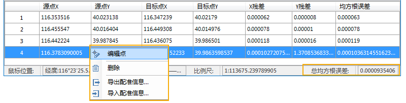

---
id: CalculatError
title: 第三步 计算误差  
---  
 在配准图层和参考图层上选择了足够的控制点后，选项卡中的“计算误差”按钮变亮，通过设置配准算法，可以计算所有控制点的误差。

 ### 操作步骤

1. 选择配准算法：在“配准”选项卡“运算”组中，应用程序提供了常用的四种算法，线性配准、二次多项式配准、矩形配准和偏移配准。方便用户根据实际需要，选择合适的算法，对待配准数据集进行配准操作。不同算法对于配准控制点数要求不同。有关配准算法请参考[配准算法介绍](../../../Features/DataProcessing/Registration/RegistrationMode)。

2. 在“配准”选项卡的“运算”组中，点击“计算误差**”按钮，进行误差计算，同时在控制点列表中列出了各个控制点的误差。这些误差包括 X 残差、Y残差以及均方根误差，同时在配准窗口中的状态栏会输出总均方根误差值。有关配准误差的具体含义请参考[“配准误差介绍”](RegistrationError)。
  
---  
3.误差的单位和当前数据平面坐标系的单位是一致的。通常情况下，配准的精度要求是要小于0.5个像元。如果影像的分辨率是30米，那么要求总均方根误差要小于15米。

4.在配准精度的要求上，各个项目的要求是不同的。当某些控制点的均方根误差大于可接受的总均方根误差时，可以通过删除或重新编辑该控制点，减小总体均方根误差，提高配准精度的目的。此操作可通过右键菜单对控制点进行编辑和删除。

5. 调整控制点位置精度，再次进行误差计算，直至误差在精度要求范围内。

6. 在控制点列表中的任意位置单击鼠标右键，在弹出的右键菜单中选择“导出配准信息”命令，将所有控制点的配准信息保存为配准信息文件（*.druf）。下次使用只需要将保存的配准信息文件导入即可。有关导出配准信息文件请参见：[导入/导出配准信息文件](importGCP)。

 ###  相关主题

 计算完误差后，可以进行下面的操作，请参见：[第四步 执行配准](Registrating)。

