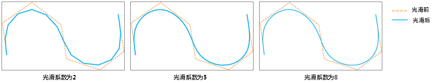

---
id: DatasetSmooth
title: 数据集光滑处理  
---  
### 使用说明

对线数据集、面数据集和网络数据集进行边界光滑处理。

### 功能入口

* **数据** 选项卡- **数据处理** - **矢量** - **线面光滑** ，弹出“数据集光滑处理”对话框。

* **工具箱** - **数据处理** - **矢量** - **线面光滑** ，弹出“数据集光滑处理”对话框。(iDesktopX)

### 参数说明

通过工具栏添加要进行光滑处理的数据集。

* 单击“添加”按钮，弹出“选择”对话框，通过该对话框可以选择待光滑的数据集。

* **光滑系数** ：是光滑处理时向两个相邻节点间插入的节点数目，是大于等于2的整数。插入的节点的位置通过 B
样条方法确定。插值点越多，处理后的折线越光滑。建议取值范围为[2,10]。

用户若想了解 B 样条法光滑过程可以参照[光滑方法说明](SmoothMeth)文档。

  
---  

