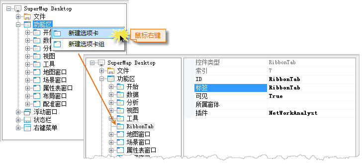
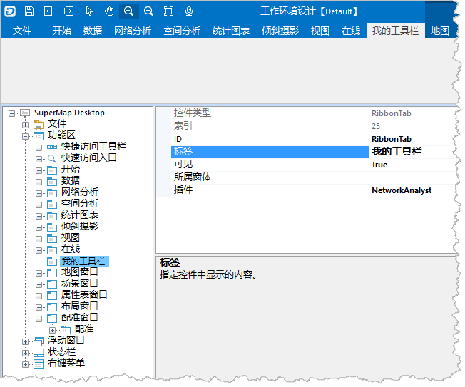

### 目的：向功能区中添加一个名为“我的工具箱”的选项卡。

  1. 单击“功能区”右键菜单的“新建选项卡”，即可新建一个默认名称为"RibbonTab"的选项卡，如下图所示。
  
    
 
  2. 选中"RibbonTab"属性表中的“标签”属性，修改选项卡的显示名称为“我的工具箱”。

的工作环境设计是所见即所得的，所有的操作在界面上，可以立即展现。新建“我的工具箱”选项卡后，会在功能区选项卡的最末位置添加一个空的选项卡。

  3. 调整选项卡的位置

左键选中“我的工具箱”选项卡，按住鼠标左键不动，将其拖拽到“开始”选项卡前面，松开鼠标左键，此时“我的工具箱”选项卡的位置如下图所示:

  

