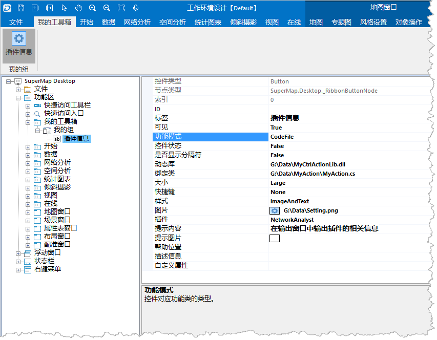

  1. 单击"[MyAction.rar](img/MyAction.rar)"，下载该文件到本地，解压后即可获得 MyAction.cs 文件。
  2. 设置“功能模式”的值为"CodeFile"，弹出“打开”对话框。在“打开”对话框中，查找 MyAction.cs 所在位置，并选择 MyAction.cs 文件，单击“打开”按钮，完成文件加载。
  3. 设置完成后，单击“确定”按钮，保存相关设置信息，如下所图示。  
  
  
