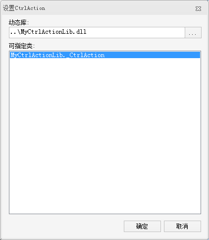
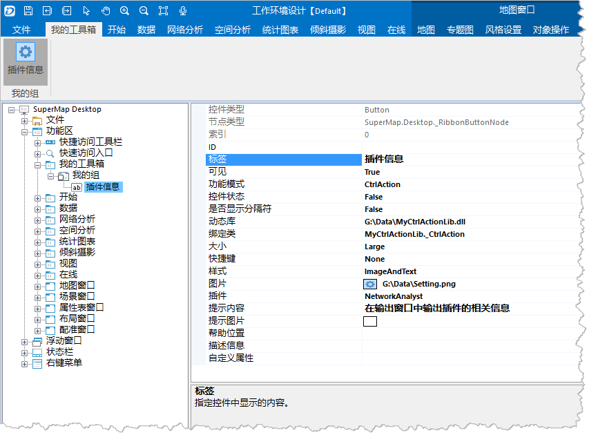

  1. 单击"[MyCtrlActionLib.dll](img/MyCtrlActionLib.dll)"，下载 MyCtrlActionLib.dll 文件到本地。
  2. 设置功能模式的值为"CtrlAction"。
  3. 鼠标单击“动态库”属性，然后单击最右侧的按钮，弹出“打开”对话框，选择 MyCtrlActionLib.dll 所在位置。
  4. 鼠标单击“绑定类”属性，然后单击最右侧的按钮，弹出“设置 CtrlAction”对话框，在可指定类列表中，选择"MyCtrlAction._CtrlAction"，单击“确定”按钮，结束设置。
  
    
 
  5. 设置完成后，“插件信息”按钮的属性信息如下所图示，此时，单击“确定”按钮，保存相关设置。
  
    

  
### 注意：

触发控件事件所执行的内容是通过某个类对象来指定的，该类必须实现 ICtrlAction 接口，当控件事件被触发时，会调用对象的 Run()
方法，该方法也是重写了 ICtrlAction 接口的 Run() 方法。CtrlAction 类就是 ICtrlAction 接口的一个实现类。
