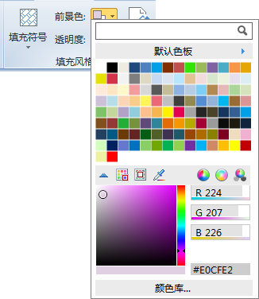
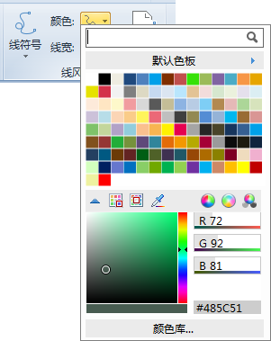
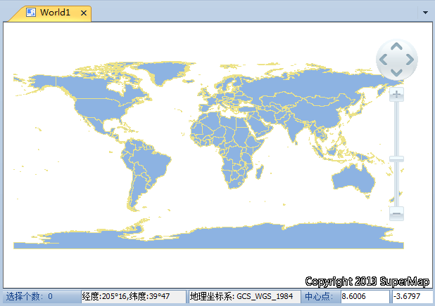

### 目的：设置名称为“World@World”的地图的显示风格

  1. 修改地图名称

当要修改一个从未保存过的地图的名称时，必须先保存该地图到工作空间中，才能修改地图的名称，在地图窗口中右键点击鼠标，在弹出的右键菜单中选择“保存地图”，在弹出的“保存地图”对话框中点击“确定”按钮，接下来就可以修改地图的名称。

在工作空间管理器的地图数据集结点处，单击鼠标右键，选择“重命名”选项，即可修改地图名称为“World”。

  2. 修改面填充颜色

鼠标单击“World”地图窗口，使其处于激活状态。在“ **风格设置** ”选项卡中的“ **填充风格** ”组中，修改面填充的前景色。

  

  3. 修改线颜色

鼠标单击“World”地图窗口，使其处于激活状态。在“ **风格设置** ”选项卡中的“ **线风格** ”组中，修改线的颜色。

  

  
修改地图名称及显示风格后的地图展示：

  
---  
  4. 保存地图 

在地图窗口中右键点击鼠标，在弹出的右键菜单中选择“保存地图”。

