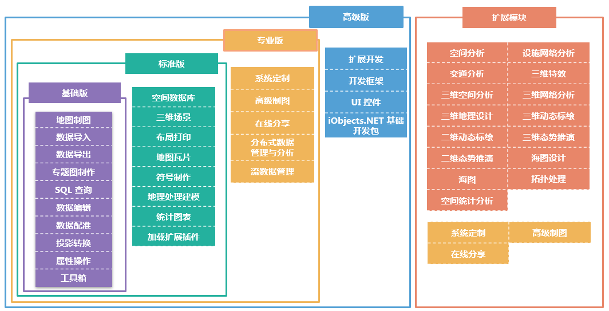

SuperMap iDesktop 是通过 SuperMap iObjects .NET、桌面核心库和 .NET Framework 4.0 构建的插件式
GIS 应用，使用 SuperMap iDesktop 桌面产品需要 SuperMap 授权，即获得许可。为满足用户的不同需求，SuperMap
iDesktop 有四种不同的许可，即基础版、标准版、专业版和高级版。级别能力依次增强，后一级别包含前一级别或前几级别中的功能。

  * **SuperMap iDesktop 基础版** ：支持空间数据引擎 SDX+管理文件数据；支持数据导入导出、类型转换、数据浏览和编辑等丰富的数据管理工具；提供了数据配准、投影转换等丰富的数据处理工具；提供了丰富的地图制图和专题图生产工具；提供工具箱对丰富的数据处理和数据分析工具进行统一管理。 

包括：地图制图、数据导入、数据导出、专题图制作、SQL 查询、数据配准、投影转换、属性操作、工具箱、数据编辑，涵盖了10个模块。

  * **SuperMap iDesktop 标准版** ：在基础版的基础上，支持空间数据引擎 SDX+管理空间数据库；支持三维场景，立体效果展示，支持倾斜摄影和BIM模型；支持布局排版打印；支持根据需求定制符号；支持生产地图瓦片；提供地理处理建模将复杂的操作过程模型化并批量执行；支持基于属性数据快速制作统计图表；支持加载扩展插件。 

包含了基础版所提供的所有内容，在基础版基础上增加了空间数据库、三维场景、布局打印、符号制作、地图瓦片、地理处理建模、统计图表、加载扩展插件，涵盖了18个模块。

  * **SuperMap iDesktop 专业版** ：在标准版的基础上，内置了系统定制、高级制图、在线分享、分布式数据管理与分析、流数据管理。 

涵盖了标准版所提供的所有内容，在标准版基础上新增了系统定制、高级制图、分布式数据管理与分析、流数据管理在线分享，涵盖了23个模块。

  * **SuperMap iDesktop 高级版** ：桌面产品中的旗舰 GIS 产品，涵盖了专业版的所有功能，支持基于桌面的插件式开发框架进行扩展开发，提供了丰富的 UI 控件和工具接口，内置了 iObjects .NET 基础开发包。 

涵盖了专业版所提供的所有内容，在专业版基础上新增了扩展开发、开发框架、UI 控件、iObjects.NET 基础开发包，涵盖了27个模块。

  * **扩展模块** ：可单独购买的功能模块，购买了标准版、专业版或高级版，三种任意一款桌面产品，均可在当前产品的基础上单独加载扩展模块。其中，专业版本默认涵盖了系统定制、高级制图、在线分享这3个模块，购买过专业版无需再单独购买这3个扩展模块。 **注** ：基础版不支持加载扩展模块。

  
---  
  
## 软件许可与功能模块对照表

下表列出了 SuperMap iDesktop 产品功能与许可信息的对应情况，方便用户查询所使用的功能需要获得的许可信息。

功能模块 | 功能介绍 | 基础版 | 标准版 | 专业版 | 高级版 | 备 注  
---|---|---|---|---|---|---  
地图制图 | 提供地图显示、渲染、编辑以及强大的出图等功能。 | √ | √ | √ | √ | \--  
数据导入 |支持导入矢量、栅格、模型等多种数据格式。支持的数据类型有：AutoCAD数据、ArcGis数据、影像栅格数据、三维模型数据、Lidar数据、Google数据、矢量文件、GeoJson、SimpleJson、GJB、电信数据等。| √ | √ | √ | √ | \--  
数据导出 | 支持导出矢量、栅格、模型等多种数据格式。支持的数据类型有：GeoJson 文件，VCT文件、TIFF文件、ArcGIS Grid文件、电信栅格文件、TIN地形文件等。 | √ | √ | √ | √ | \--  
专题制图 |提供了强大丰富的专题图制作功能，可以根据各种需求制作出生动、精美的专题图。包括标签专题图、单值专题图、统计专题图、分段专题图、点密度专题图、热力图与网格聚合图等。| √ | √ | √ | √ |\-- 
SQL 查询 | 支持通过SQL 表达式，进行数据查询。 | √ | √ | √ | √ | \--  
数据编辑 | 提供全面的数据编辑功能； 提供了丰富的矢量数据和栅格数据处理功能。支持对数据创建空间索引和字段索引。 | √ | √ | √ | √ |\--  
数据配准 | 提供数据配准功能，包括快速配准和三维配准。 | √ | √ | √ | √ | \--  
投影转换 | 提供数据坐标系设置及投影转换功能，其中投影转换包括：坐标点转换、数据集转换、批量投影转换、四参数转换等功能。 | √ | √ | √ | √| \--  
属性操作 | 提供对空间数据的属性表全面操作和处理，包括创建、编辑、浏览、输出功能以及统计分析等功能。 | √ | √ | √ | √ | \--  
工具箱 | 工具箱集成了丰富的数据处理和数据分析功能。 | √ | √ | √ | √ | \--  
空间数据库 | 支持空间数据引擎 SDX+管理空间数据库，支持13种以上的常用数据库读写，包括OraclePlus、OracleSpatial、SQLPlus、MySQL等，支持4种以上的国产数据库的读写，包括DM、Kingbase、HighgoDB、BeyonDB 等。 | × | √ | √ | √ | \--  
三维场景 | 提供对三维数据的浏览、编辑，实现二三维一体化的数据显示与操作。场景中支持多源数据进行显示和浏览。 | × | √ | √ | √ | \--  
布局打印 | 提供布局排版、打印功能。 | × | √ | √ | √ | \--  
符号制作 | 支持对符号资源以逻辑分组的方式进行管理；提供了制作新符号或者编辑已有的符号的功能。可通过界面交互的方式方便、快速、准确地完成符号制作编辑。 |× | √ | √ | √ | \--  
地图瓦片 | 提供单任务方式生成栅格瓦片或矢量瓦片，并支持更新/追加瓦片、续传/恢复瓦片等地图瓦片技术| × | √ | √ | √ | \--  
地理处理建模 | 地理处理建模集合了丰富的数据处理和数据分析建模功能，用户可根据需要设计可连续执行的模型，实现了无人值守、一键化的连续操作； | × | √| √ | √ | \--  
统计图表 | 提供丰富的图表可视化工具，基于属性数据快速统计，可以很方便的进行数据挖掘，可保存输出，可跟地图进行交互、联动。 | × | √ | √ | √| \--  
加载扩展插件 | 提供插件管理器，支持单独加载扩展模块。 | × | √ | √ | √ | \--  
系统定制 | 提供可视化的桌面系统功能和界面定制，通过工作环境设计器 快速定制桌面GIS系统。 | × | × | √ | √ | \--  
高级制图 | 提供高效的制图功能，包括 DLG 数据自动制图、分级配图功能；提供高效的矢量化功能，包括符号化快速矢量化功能；提供多进程并行切图功能，随着切图进程的增加，切图时间递减；提供检查瓦片功能.|× | × | √ | √ | \--  
在线分享 | 支持对接公有云 Online 和私有云iPortal，在线检索和分享地图、数据、符号库、色带和自定义资源；支持检索、浏览和使用在线服务。支持对接 iServer 快速发布 iServer 服务。| × | × | √ | √ | \-- 分布式数据管理与分析 | 支持在线的多种基于分布式数据的计算和分析，包括密度分析、叠加计算、对象查询、空间汇总等。 | × | × | √ | √ |\--  
流数据管理 | 支持实时矢量数据接入；支持基于矢量数据流制作专题图、统计图表等，通过不同的方式对数据流进行渲染，实时反映数据的变化趋势。 | × | × |√ | √ | \--  
扩展开发 | 支持基于桌面的插件式开发框架进行扩展开发。 | × | × | × | √ | \--  
开发框架 | 提供基于桌面的插件式开发框架。 | × | × | × | √ | \--  
UI 控件 | 提供丰富的 UI 控件和工具接口。 | × | × | × | √ | \--  
iObjects.NET 基础开发包 | 提供 iObjects.NET 基础开发包。 | × | × | × | √ | \--   

功能模块 | 功能介绍 | 许可信息 | 备 注  
---|---|---|---  
系统定制 | 同专业版“系统定制” | **专业版** 及以上或系统定制模块许可 | \--  
高级制图 | 同专业版“高级制图” | **专业版** 及以上或高级制图模块许可 | \--  
在线分享 | 同专业版“在线分享” | **专业版** 及以上或在线分享模块许可 | \--  
空间分析 |提供多种基于矢量数据的空间分析功能，包括缓冲区分析、叠加分析、邻近分析、矢量裁剪、数据融合、属性更新等数据处理和分析功能；提供多种基于栅格数据的空间分析功能，包括插值分析、表面分析、水文分析、距离栅格、栅格统计、矢量栅格转换、栅格裁剪、代数运算等功能，为GIS 应用的分析决策提供强有力的支撑。  | 空间分析模块许可 | \--  
设施网络分析 | 提供要素追踪、邻接要素分析、通达要素分析、关键要素分析、连通性分析和环路检查等设施网络分析功能。 | 设施网络分析模块许可 | \--  
交通分析 |提供选址分区分析、旅行商分析、物流配送分析、最佳路径分析、最近设施查找分析等交通网络分析功能；提供基于线性参考的动态定位能力；提供路径规划和导航能力。支持室内导航，提供室内分层路网数据的二三维联动制作和展示能力；提供室内分层路网数据导航模型编译能力；支持室内室外一体化路径规划和导航模拟能力。| 交通分析模块许可 | \--  
三维空间分析 | 提供基于三维场景的通视性、地形匹配等三维空间分析功能。 | 三维空间分析模块许可 | \--  
三维特效 | 提供三维立体显示、三维粒子系统（雨雪火焰烟花喷泉等效果）、三维材质（水面效果）、太阳阴影等三维特效功能。 | 三维特效模块许可 | \--  
三维网络分析 | 提供三维建模、三维设施网络分析和三维交通网络分析以及爆管分析的功能。 | 三维网络分析模块许可 | \--  
二维动态标绘 | 提供二维动态标绘功能及所带的二维动态标绘符号库。 | 二维动态标绘模块许可 | \--  
三维动态标绘 | 提供三维动态标绘功能及所带的三维动态标绘符号库。 | 三维动态标绘模块许可 | \--  
二维态势推演 | 提供基于二维动态标绘的态势推演功能。 | 二维态势推演模块许可 | \--  
三维态势推演 | 提供基于三维动态标绘的态势推演功能。 | 三维态势推演模块许可 | \--  
三维地理设计 |提供规则建模功能，包括三维几何体、房屋、地质体的构建；提供模型数据的提取、分析和计算功能，包括简化、凸包、阴影体、布尔运算、剖面分析、提取边界等；提供倾斜摄影、地形数据的裁剪、镶嵌与历史数据管理功能。| 三维地理设计许可 | \--  
海图 | 提供导入导出海图000数据、海图数据浏览、查看物标信息、编辑物标属性信息、设置海图的显示效果等功能。 | 海图模块许可 | \--  
海图设计 |基于国际海事组织（IHO）颁布的S-52显示标准显示电子海图；支持导入、导出或者制作符合S-57数据传输标准的海图数据；支持依据S-58电子航海图检核标准检查数据；确保数据空间和描述属性的有效性，提高生产质量。| 海图设计模块许可 | \--  
空间统计分析 | 支持利用统计分析方法，通过空间数据，认识与地理位置相关的数据间的空间依赖、空间关联或空间自相关，通过空间位置建立数据间的统计关系。 |空间统计分析模块许可 | \--  
拓扑处理 | 提供拓扑处理的功能。包括拓扑检查、拓扑构面、拓扑错误自动修复、拓扑错误交互修复、拓扑关系维护和管理等功能。 | 拓扑处理模块许可 | \--  
  
**加载扩展模块、系统定制与扩展开发的补充说明**

  * **加载扩展模块** ：扩展模块可以单独购买，包括空间分析、交通分析、三维地理设计等18个功能模块，若购买了标准版、专业版或高级版，即可加载单独购买的扩展模块。
  * **系统定制** ：通过工作环境设计器快速定制桌面系统的功能和界面，购买专业版或高级版，即具备系统定制的能力，若购买了标准版，也可以单独购买 **系统定制** 扩展模块。
  * **扩展开发** ：基于桌面的开发框架进行扩展开发，可调用桌面开放的接口进行二次开发，购买高级版，即具备系统定制的能力。

**备注：** 在使用高级版桌面进行扩展开发时，若需调用组件的接口，则需要 SuperMap iObjects
对应模块的许可，二次开发后的插件，若需部署至其他机器，则该机器需要有 **桌面插件加载** 的许可，以及 **相关的组件许可**
。例如：基于桌面二次开发时，调用组件空间分析模块的接口开发了插件，插件分发部署到的机器上，该机器需要有桌面 **加载扩展插件** 的许可，以及
**SuperMap iObjects 空间分析模块** 的许可。

桌面不同版本对上述功能的支持情况如下表：

桌面版本 | 加载扩展模块 | 系统定制 | 扩展开发 |   
---|---|---|---  
基础版 | X | X | X  
标准版 | √ | X | X  
专业版 | √ | √ | X  
高级版 | √ | √ | √  
  

