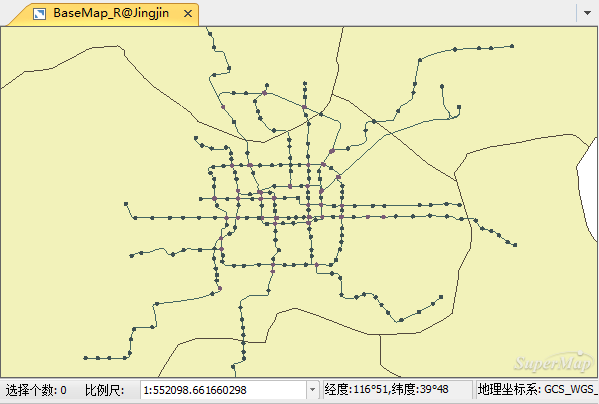

使用  安装目录\SampleData\City\Jingjin 目录下 Jingjin.udb 数据源中的数据集，新建一幅默认的地图。

**打开数据**

  1. 启动  应用程序。 
  2. 在SampleData文件夹中打开“ **Jingjin.smwu** ”。成功打开工作空间后，工作空间管理器中的“未命名工作空间”会更改为已打开的工作空间的名称，例如Jingjin；数据源集合结点下将增加一个或多个结点，对应刚打开的工作空间下保存的所有数据源，在本例中，就只有一个Jingjin数据源。

**注** ：只有SuperMap iDesktop的完整安装包才带有示范数据，如果使用的是绿色精简包，则不带有示范数据。

**新建地图**

有两种方式可以新建地图。

  1. **方式一** ：在Jingjin数据源下，双击“BaseMap_R”数据集，将其打开在地图窗口。接着，将“subway”、“substation”、“ChangeStation”三个数据集逐一拖拽到当前打开的地图窗口，添加到地图窗口中的数据集均以默认风格显示。
  2. **方式二** ：单击“ **地图** ”结点，在其右键菜单中选择“ **新建地图窗口** ”，在弹出的“选择”对话框中，左侧数据源中选择“Jingjin”，右侧数据集列表中，按住键盘上的“Ctrl”键，同时选中“BaseMap_R”、“subway”、“substation”、“ChangeStation”四个数据集，点击“ **确定** ”，选中的数据集被添加到新建的地图窗口中。

**注** ： **方式一** 中，需要注意地图窗口中图层的显示顺序，为了避免图层遮挡，地图窗口中不同类型图层由上到下的显示顺序一般为：
**文本-->点-->线-->面** 。而在 **方式二** 中，在地图中添加数据集时会自动按照“文本-->点-->线-->面”的显示顺序排序。

如下图所示，为新建地图的默认效果。

   

###  相关主题

 [符号化地图图层](SymbolizeMapLayers.html)

