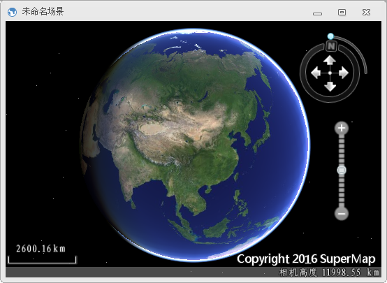
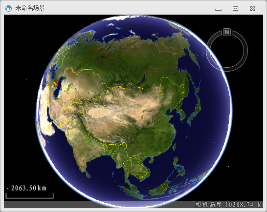

  1. 启动  应用程序；
  2. 点击功能区“ **开始** ”选项卡“ **浏览** ”组“ **场景** ”下拉按钮的下拉按钮部分，在弹出的下拉菜单中选择“ **新建球面场景窗口** ”按钮；或者在工作空间管理器中，右键点击场景集合结合结点，在弹出的右键菜单中选择“ **新建球面场景** ”项。
  3. 新建的场景窗口中的场景，如下图所示：  

 

  4. 用户如果需要加载全球框架数据，可以打开“ **文件** ”选项卡中的“ **选项** ”按钮，通过修改“ **选项** ”对话框上的“ **常用** ”项来设置。勾选“ **新建三维场景时自动加载框架数据** ”项， 则场景中会加载  安装包所提供框架数据。因此，新建一个场景窗口后，场景中默认具有了一些图层，这些图层均为全球范围的数据，如下图所示；  
   

###  相关主题

 [第二步：加载数据](Step2_LoadData.html)

