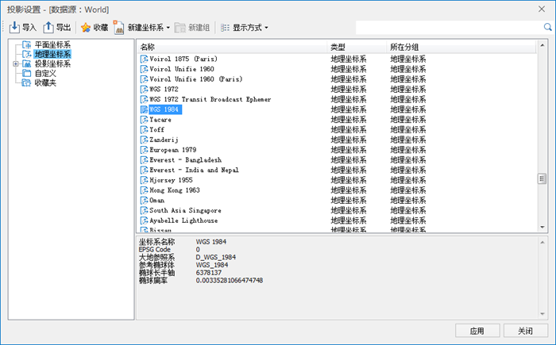
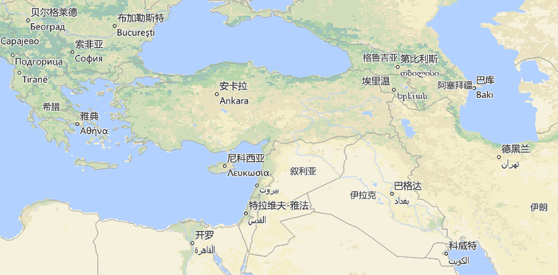

###  数据说明

世界地图是一系列使用不同地图投影制作的小比例尺电子地图，要素较为概略，主要涉及到世界各国的位置分布和地理形态，风格柔和，适用于做底图。

###  制图要点

  * 世界地图表示世界各大洲、大洋与主要河流、湖泊的总体分布，采用分国设色方法（一般使用四色图）明确各国家和地区的精确位置和地理形态，标明了国名和首都等基本内容；
  * 采用动态投影的方式可以在共享一份数据源的前提下制作不同投影的地图，世界地图常用的投影包括WGS_1984投影与Robinson投影；
  * 支持通过Unicode编码的方式将不同国家的首都名称以自己国家的语言保存并展示在地图中；
  * 对于航线地图，可以在“地图”选项卡中“浏览”分组下的“设置”按钮中设置“全球连贯漫游”，使得航线连贯不中断。

###  制图流程

  1. 新建地图窗口
  2. 设置地图投影

由于此系列地图采用了不同的投影，而数据源中的数据统一采用的是"WGS_1984"的投影方式，所以需要开启"动态投影"的功能。在“地图”选项卡中的“地图属性”中开启动态投影，并在“投影设置”中设置想要选择的地图投影。

  

  
六幅地图中，World_Google、World_Image与World_AirLine采用的投影为WGS_1984，World_Common与World_Robinson采用Robinson投影，而World_
VanDerGrintenI 采用VanDerGrintenI投影。

  3. 制作面状要素单值专题图

这里以World_Common为例来阐述具体的制作流程

采用“制作专题图”→“单值专题图”的工具制作各个国家行政面的单值专题图，并为专题图设置合适的颜色，一般为四色图。

  4. 添加其它要素

添加世界范围内的主要河流与湖泊。

  5. 制作注记

注记的制作采用“制作专题图”→“标签专题图”来进行。国家的名称注记只需要制作普通的标签专题图即可，这里需要注意的是首都的名称注记，软件中支持设置每个国家的首都以自己国家的语言来显示。

  

