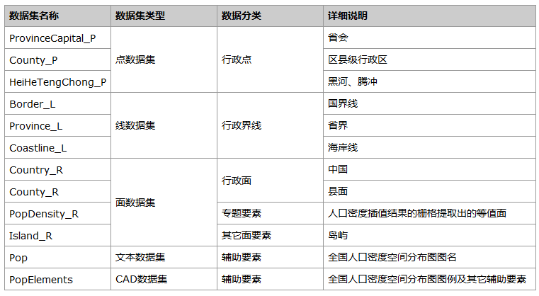
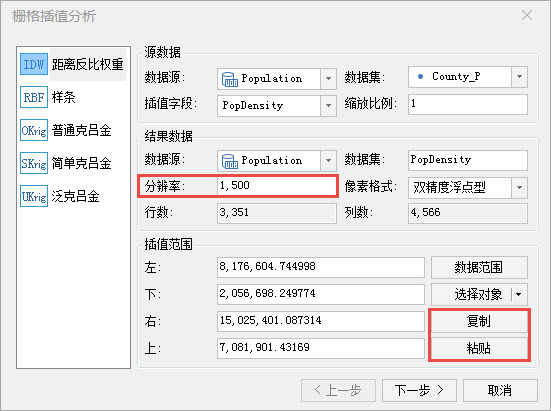
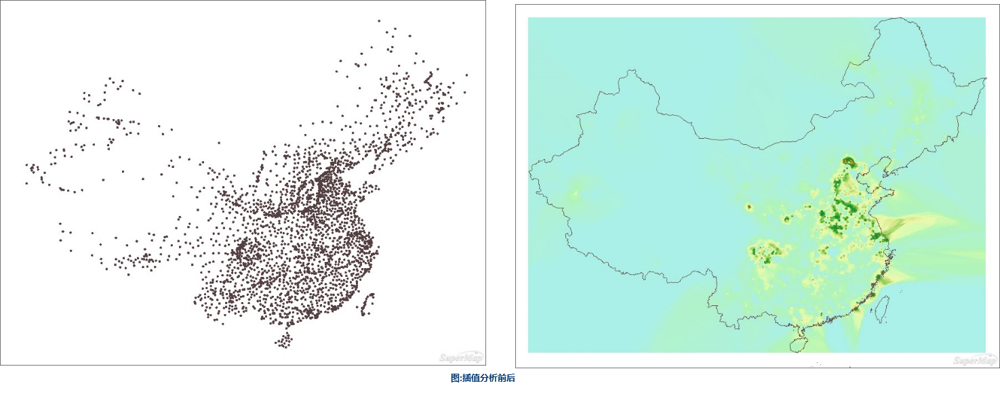
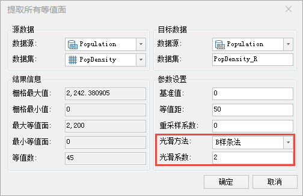
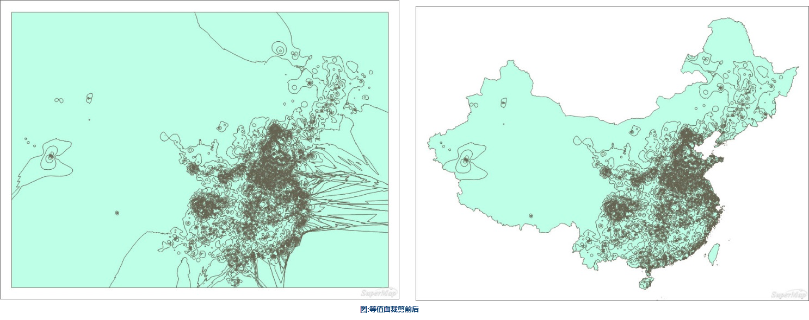
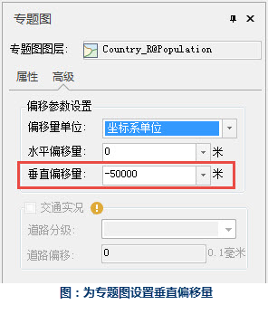
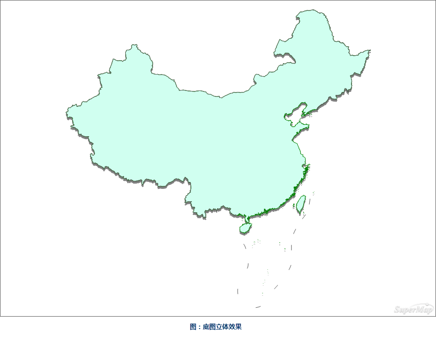
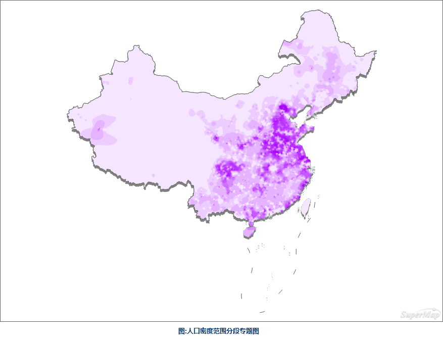
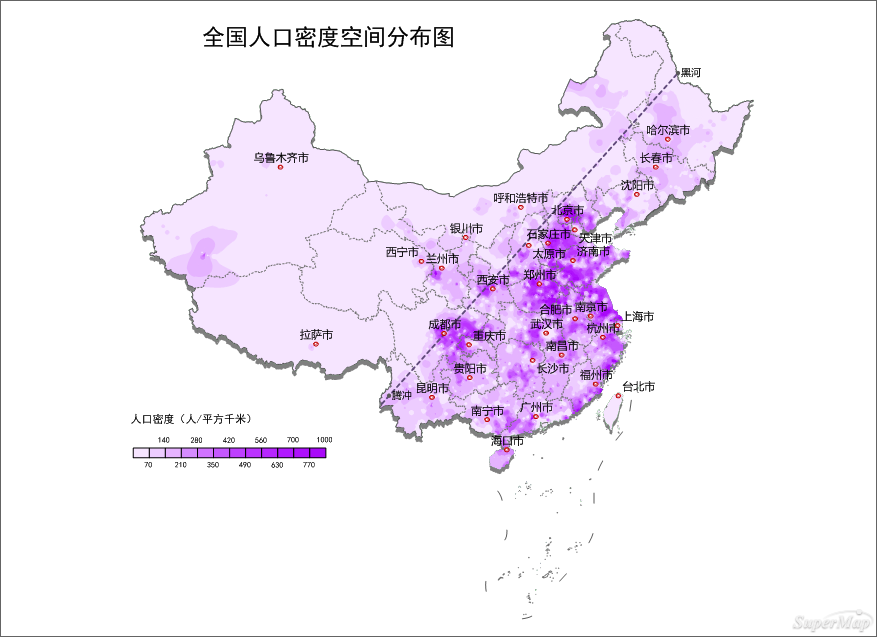

###  数据说明

全国人口密度空间分布图反映的是2001年全国各地的人口密度分布状况。

###  数据详细介绍

人口密度数据来自于各县的《国民经济与社会发展统计公报》，其余数据为国家测绘地理信息局制作的公共版中国1：100万比例尺数据。

数据源中的数据内容详细说明如下表。

  
  
###  数据处理

  1. 插值分析

原始数据是包含人口密度属性的区县点数据，对这个数据以人口密度为插值字段进行插值，使用“分析”面板中的“栅格分析”→“插值分析”工具来进行，经过多次试验，分辨率设置为1500比较合理。由于插值分析的结果是取所有参与插值点的外接矩形，而所有区县点的外接矩形不能包括完整的制图所需要的范围，所以需要将区县面的范围复制过来，最终生成矩形的栅格数据。

  
 
   

  2. 提取等值面

使用“分析”面板中的“栅格分析”→“表面分析”→“提取所有等值面”对插值分析的结果提取等值面并对等值面的轮廓进行光滑处理。由于栅格分析的结果是矩形，提取出来的等值面也是矩形轮廓，需要裁剪。

  

 

###  制图要点

  * 对带有人口密度数据的区县点数据进行插值分析（分辨率推荐设置为1500）并提取等值面（等值距推荐设置为50），然后对等值面制作范围分段专题图，可以直观的展示全国人口分布规律；
  * 添加省界与省会使省间的人口密度差异更加明确；
  * 黑河-腾冲一线，也就是胡焕庸线，是地理学家胡焕庸于1935年首次提出的，大致区分出了中国人口东南和西北分布的断层式差异，在人口地图上起到画龙点睛的作用；
  * 对中国的面域制作单值专题图，将单值专题图设为灰色并设置一定的垂直偏移量（这里设置为-50000米），然后叠加在中国的底图面下，会让底图呈现立体效果；
  * 图名与图例可以增强地图表现力。

###  制图流程

  1. 制作具有立体效果的底图

新建地图窗口，添加中国面，并以SmUserID为表达式制作单值专题图，将单值专题图设为灰色并设置一定的垂直偏移量，叠加在中国面之下，会让底图出现立体感。

  

  

  2. 制作人口密度范围分段专题图

对裁剪后的等值面以人口密度为表达式制作范围分段专题图选择等距分段的方法将人口密度分为13段，并设置合适的颜色方案。

  

  3. 添加省会及注记

为了直观的表现全国的人口密度分布规律，同时增加地图的表现力，需要加上省会城市，并为其制作标签专题图作为注记。

  4. 添加其它辅助要素

(1)添加黑河腾冲一线。黑河-
腾冲一线，也就是胡焕庸线，是地理学家胡焕庸于1935年首次提出的，大致区分出了中国人口东南和西北分布的悬殊差异，在人口地图上可以起到画龙点睛的作用。

(2)添加图名和图例。

### 成图展示

  
