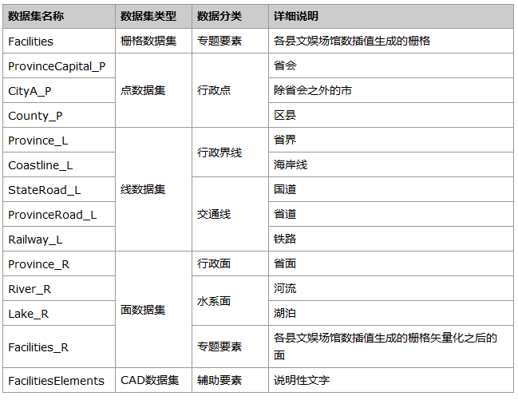
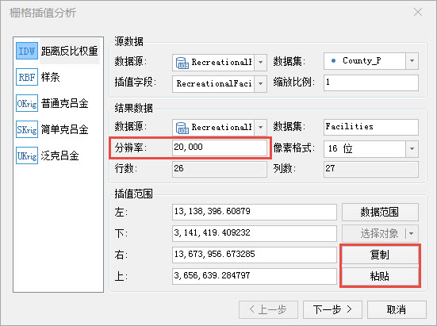
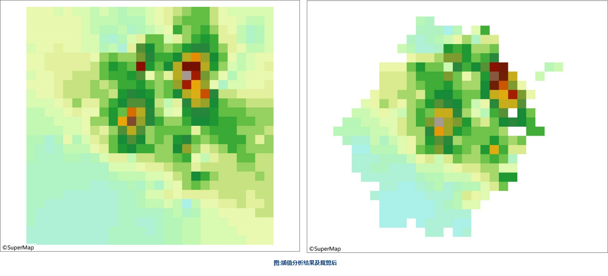
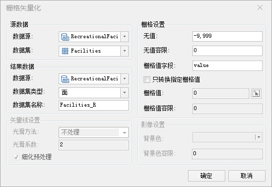
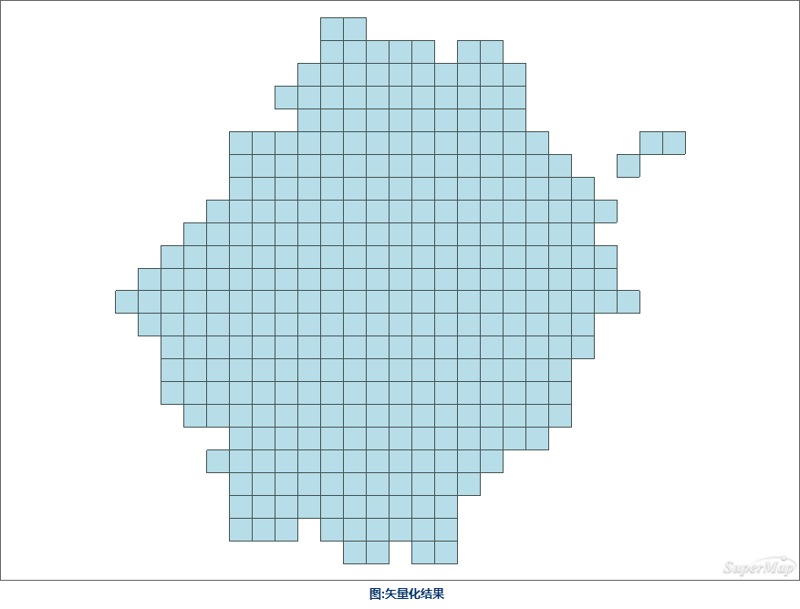
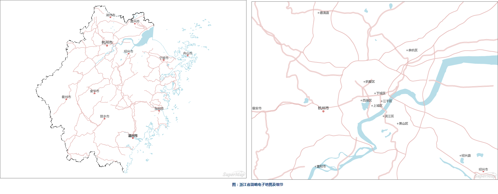
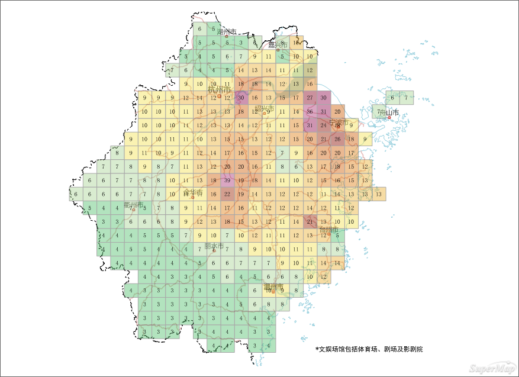

### 数据说明

浙江省文娱场馆分布图以热点格网图的形式来反映省内不同地区的文娱场馆分布情况。将浙江省划分为20000m*20000m的方格，为不同的方格设置颜色渐变使得整幅图具有热点图对权重的层次渐变直观性，同时将每个方格代表的具体场馆数以注记的形式标出，保证了数据的完整性。

### 数据详细介绍

浙江省各个区县的文娱场馆数来自于浙江统计信息网（网址为http://www.zj.stats.gov.cn/）发布的浙江省2015年统计年鉴，其余数据来自于国家测绘地理信息局制作的公共版中国1：100万比例尺数据。

数据源中的数据内容详细说明如下表。  

 
  
### 数据处理

  1. 插值分析

使用“分析”选项卡中的“栅格分析”→“插值分析”工具对区县的点进行插值分析。由于插值分析的结果是取所有参与插值点的外接矩形，而所有区县点的外接矩形并不能包括完整的浙江省的范围，所以需要将浙江省的范围复制过来，或者适当再加大插值范围。在插值分析时，由于考虑到之后作图时，方格需要适当大一些，可以设置较大的分辨率，经多次试验，这里将分辨率设置为20000m。

  

   

  2. 栅格矢量化

使用“分析”选项卡中的“栅格分析”→“矢栅转换”→“栅格矢量化”工具，对裁剪后的栅格数据进行矢量化。

  

  

### 制图流程

  1. 制作浙江省简略电子地图

添加行政界线、主要河流与主要道路，为不同的比例尺区间设计不同的符号，同时为不同的图层设置不同的显示比例尺。此处的电子地图制作方法与普通电子地图的制作方法相同，只是比较简略，只需包含浙江省内主要的行政点、道路和水系，并且道路和水系无需标出注记。

   

  2. 制作范围分段专题图

添加栅格矢量化之后的面，并以value为表达式制作范围分段专题图，采用等距分段的方法共分为12段。为范围分段专题图选择合适的颜色方案，并对此图层设置一定的透明度。在使地图直观易懂的前提下，为了兼顾到数据的完整性，以标签专题图的形式将每一个方格所含区域的文娱场馆数标出来。

  3. 添加辅助要素

添加说明性文字。

### 成图展示

  

