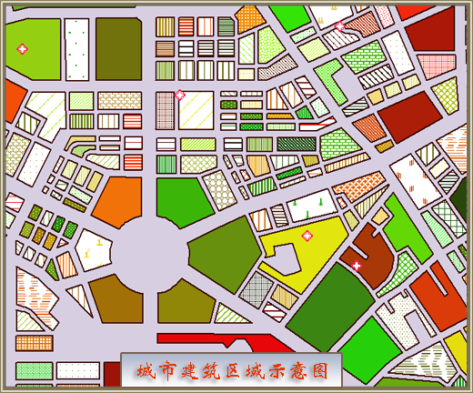

自定义专题图通过自定义属性字段来创建专题图，根据数值型字段的值对应风格设置表来设置显示风格，可以更自由的表达数据信息。

自定义专题图支持编辑功能。自定义专题图可基于任一点、线、面矢量图层制作。在制作自定义专题图时，首先将要制作专题图的矢量图层设置为当前图层，即在图层管理器中选中该矢量图层。

自定义专题图适合用户想要表达内容比较丰富，属性分类结构较多的复杂情况。下图是模拟城市内部的复杂建筑区域结构分类图。

  

  
上图是由自定义专题图功能制作出的专题表达图例，单一颜色区域表示公共设施建筑所在区域，不同色块可表示不同种类公共建筑。

有内部填充符号的区域代表私有建筑区域，不同填充物表示不同应用类别的私有建筑区域。

红色空心十字点符号表示医院类建筑所在地。

### 制作自定义专题图的两种途径：

 [新建自定义专题图](CustomizeMapDefault)

 [修改自定义专题图](CustomizeMapGroupDia)

###  相关主题

 [编辑专题图](../EditingMap/EditingMap)
