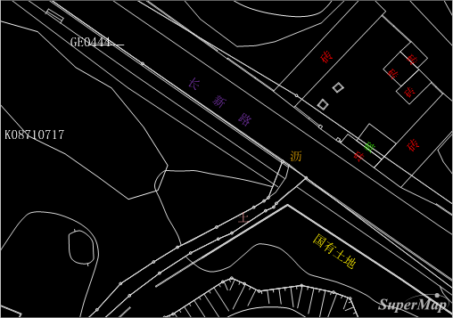
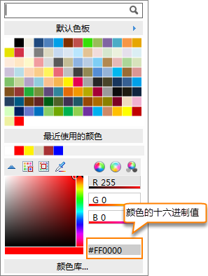
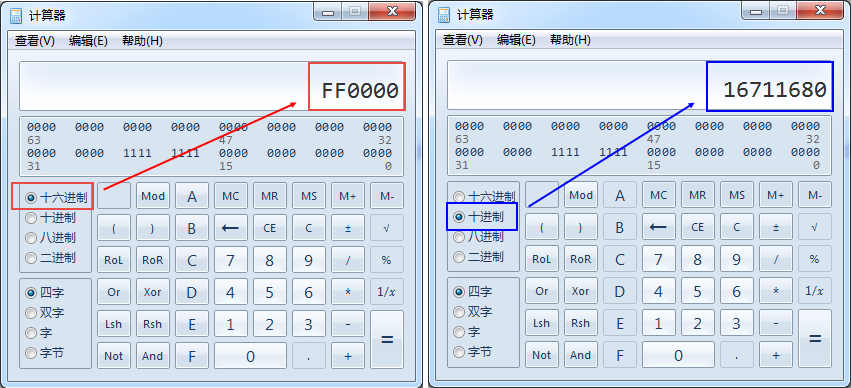
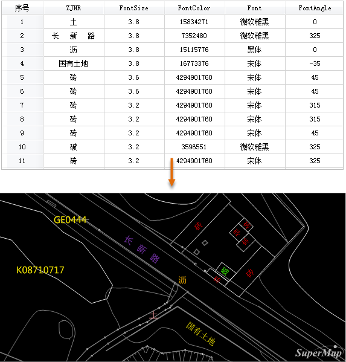

### 使用说明

自定义标签，用来实现同一个专题图层中，不同类型的标签在字体、大小、旋转角度、颜色上的多样性展示。例如CAD数据导入后，对其中包含有文本信息的点数据制作自定义标签专题图，就可以达到与CAD中相同的文字显示效果。如下图所示，为对导入的CAD文件中的点数据制作自定义标签的显示效果。
**注意**：点、线、面数据集均支持制作自定义标签，但线数据集的自定义标签不支持沿线标注，通过指定字段的方式控制标签的字体、文字大小、文字旋转角度、文字颜色、标签偏移量，只对点标签专题图有效。

  

  
### 注意事项

使用属性字段控制标签的风格，对于字段类型或者字段值有一定的要求，需要保证数据符合这些要求才能获得正确的显示效果。具体说明如下：

1. **字体名称：** 字段类型为可以存储文本信息的类型，如：文本型，字段值为字体名称，如：微软雅黑、宋体、黑体，则对应记录中的标注文本以指定的字体进行显示；如果指定的字体在系统中不存在或者为空值，将按照未勾选“启用表达式”时的字体设置。
2. **字体大小：** 字段类型为数值型，字段值为文字字高，单位为毫米。如果字段中为空值，将按照默认的字高等于4mm来显示。
3. **旋转角度：** 字段类型为数值型，字段值为字体的旋转角度，单位为度。角度旋转以逆时针方向为正方向，对应数值为正值；角度值支持负值，表示沿顺时针方向旋转。如果字段中为空值，将按照默认的角度为0来显示。
4. **字体颜色：** 字段类型为数值型，字段值为要设定颜色的十进制数值。如果字段中为空值，将按照未勾选“启用表达式”时设置的文本颜色来显示。

获取颜色的十进制数值的方法如下：在颜色面板中选择需要的颜色，得到颜色的16进制值，将数值的后六位复制并粘贴到计算机的十六进制模式下，再切换到十进制，换算得到的这个数值就是颜色的十进制数值，将这个值写入属性表中即可。如下图所示：

  
---  
  
  
除字体名称外，字体大小、旋转角度、字体颜色，也可以通过直接输入数值的方式，设定标签风格。

如下图所示，为制作自定义标签专题的属性表内容示意以及得到的标签显示风格的效果图。

  
