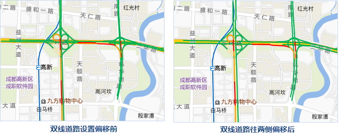

用于对当前单值专题图中的单值图进行高级参数设置。在该选项卡中的所有设置都会实时反映到当前单值专题图中，即所见即所得。

1. “ **偏移参数设置** ”区域：该区域用于设置单值专题图中点、线、面对象的偏移量。 
  * **偏移量单位：** 用于设置偏移量数值的单位。点击右侧的下拉按钮，在弹出的下拉菜单中，系统提供"坐标系单位"和"0.1毫米"两种偏移单位供用户选择。"0.1毫米"，表明符号的偏移量以0.1毫米为单位；"坐标系单位"，则所设置的偏移量与地图的坐标系的单位保持一致。
  * **水平偏移量：** 用于设置标签相对于其表达对象的水平偏移量。可以直接输入数值设置偏移量；也可以选择该图层的一个数值型的字段，使用字段值作为偏移量。
  * **垂直偏移量：** 用于设置标签符号相对于其表达对象的垂直偏移量。可以直接输入数值设置偏移量；也可以选择该图层的一个数值型的字段，使用字段值作为偏移量。
2. “ **交通实况** ”区域：用于设置道路分级和道路偏移量，适用于小比例尺下的[交通路况图](../../ApplicationTheme/TrafficCondition/AboutTrafficCondition)。 
  * 道路分级：设置道路的显示情况，字段值为 0 表示不显示路况，例如：小比例尺下的辅道；字段值为 1 表示所显示路况的道路为单线道路，例如：匝道；字段值为 2 表示所显示路况的道路为双线道路，例如：高速公路。
  * 道路偏移：设置路况专题图中的双线线型分别向两侧偏移的距离，偏移量为正，则表示往线方向左侧偏移；偏移量为负，则表示往线方向的右侧偏移，单位为0.1毫米。通过对道路进行两侧偏移，使得小比例尺下也可以清楚地显示出双线道路的路况。
  
---  

### 备注

* 通过对专题图图层设置偏移，可以实现二维地图的阴影效果，以达到更理想的制图效果。    
---  
图：专题图阴影效果图  
* 暂时不支持对三维点、线、面图层制作的专题图进行偏移设置。

###  相关主题

 [修改单值专题图](UniqueValuesMapGroupDia)

 [“属性”选项卡](PropertiesDia)

