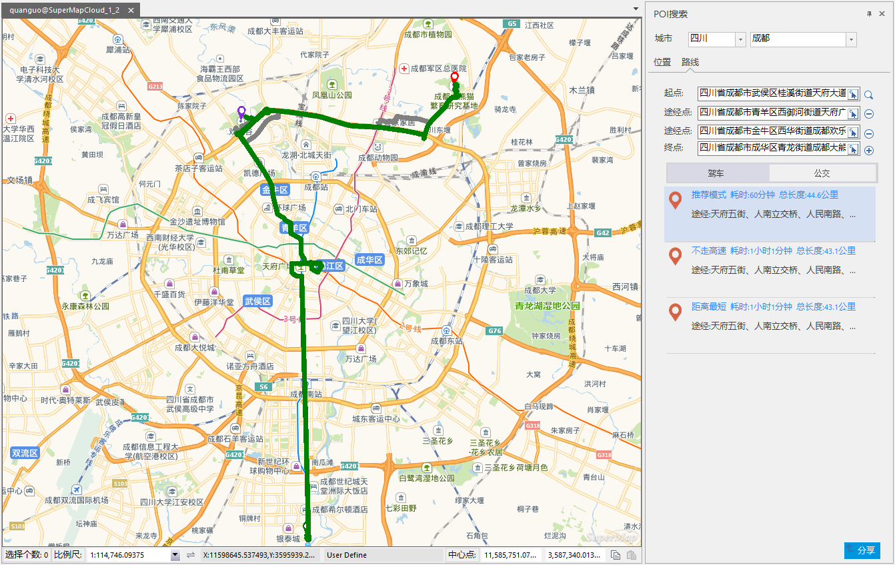

### 使用说明

支持查询路线公交，可基于 SuperMap Online 地图服务，对驾车线路及公交线路进行查询。

### 操作步骤

1. 在地图窗口打开一幅在线地图服务。
2. 在“ **在线** ”选项卡->“ **服务** ”组->“ **查询路线公交** ”按钮，在地图窗口右侧弹出“ **查询** ”面板。
3. 在“查询”面板中，输入查询信息： 
  * **城市** ：确定查询的省份及城市名称，可手动输入名称或点击文本框下拉按钮在下拉菜单中选择所要查询的城市名称。 
  * **起点** ：确定查询起点。可在文本框中手动输入查询起点，或通过在地图上选点确定起点。具体选点操作如下：单击选择按钮，在地图窗口中，鼠标指针变为十字光标，在所要确定的起点位置处单击鼠标左键，即可确定起点位置。
  * **终点** ：确定查询终点。可在文本框中手动输入查询终点，或通过在地图上选点确定终点。具体选点操作如下：单击 选择按钮，在地图窗口中，鼠标指针变为十字光标，在所要确定的终点位置处单击鼠标左键，即可确定终点位置。
4. 确定起点和终点后，单击“ **驾车** ”或“ **公交** ”按钮，查询驾车路线或公交路线。也可单击查询按钮进行查询。
5. 查询面板中显示出查询结果，查询结果以绿色线型显示在地图窗口。若查询结果为多个，选择某个结果，在地图窗口该线路会以绿色线条闪烁显示，未被选中的线路为灰色线条。驾车路线查询结果一般有三种类型，分别是：推荐模式、不走高速、距离最短三种路线
  * **推荐模式** ：该模式会优先考虑高速路等高级道路，选择最优路线进行导航。 
  * **距离最短** ：该模式表示路线结果为距离最短的路线。
  * **不走高速** ：表示路线果为不走高速路段。
6. 当选择查询驾车路线时，可设置添加途经点，单击添加途经点按钮，添加一个或多个途经点。如若删除某个途经点，可单击途经点后的删除按钮，即可删除该途经点。  

  

### 相关内容：

 [配置服务](ConfigureAddress.html)

 [在线地图](OnlineMap.html)

 [在线数据](OnlineData.html)

 [在线符号库](OnlineSymbol.html)

 [我的数据](OnlineMyData.html)

  

