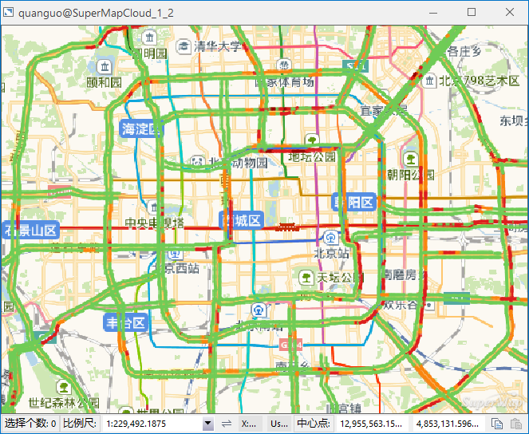

### 使用说明

支持
Online在线服务，服务包括：[实时路况查看](onlineservice.html#1)、[POI搜索](POIRetrieval.html)以及[查询路线公交](QueryRoute.html)。基于 SuperMap Online 地图服务，可以快速实时的查看路况信息、查询AQI实时掌握空气质量指数，快速实现位置定位及公交线路查询等。

### 实时路况

实时路况数据来自腾讯地图。当实时数据与当前地图坐标系不一致是，程序会自动开启当前地图的动态投影。

  * 腾讯地图的实时路况数据，包含全国主要道路（高速、国道、主要省道）、城市和县、镇的实时路况信息。该数据以REST Map服务形式提供可直接调用。

### 操作步骤

  1. 在地图窗口打开一幅在线地图服务。由于加载实时路况数据较大，建议用户在查看数据时 ，先将地图定位至查询的相关城市，以加快数据的加载及浏览速度。

 **注意** :用户也可打开任意本地数据，加载和查看该数据位置的实时路况数据。

  2. 在“ **在线** ”选项卡->“ **服务** ”组->“ **实时路况** ”，实时路况数据即被加载至当前地图窗口。
  3. 程序将对加载的实时数据自动建立缓存，以提高浏览速度。如若用户需要刷新当前实时路况数据，可地图窗口单击右键，在菜单中点击“刷新”按钮，即可对当前路况数据进行实时刷新。  

  
  

### 相关内容：

 [配置服务](ConfigureAddress.html)

 [在线地图](OnlineMap.html)

 [在线数据](OnlineData.html)

 [在线符号库](OnlineSymbol.html)

 [我的数据](OnlineMyData.html)

