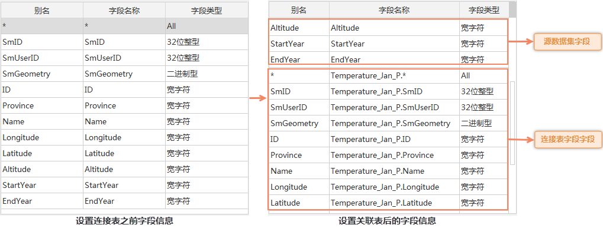

通过设置关联字段，为当前（源）数据集设置与之相关联的数据集，以增加源数据集的字段信息，便于 SQL 查询和 SQL 条件的构建等。

**连接表设置**
对话框中的表格区域，每条记录对应一个关联关系，单击对话框中的“添加”按钮，将新建一个关联关系，支持相同数据集设置多个连接关系。下面详细介绍每个字段的含义：

  * **名称** ：标识所建立的关联关系，便于区分不同的连接设置。连接的名称支持编辑。
  * **关联表达式** ：显示了连接本表和外接表的连接条件。用户在进行了外接表、本表字段等设置后，应用程序会自动生成连接条件。
  * **外接表** ：与当前（源）数据集属性表相关联的数据集。单击该单元格，该单元格右侧出现下拉按钮，单击下拉按钮弹出下拉菜单，列出了源数据集所在数据源下，除该数据集外的所有具有属性表的数据集，用户可以选择某个数据集作为关联数据集。
  * **本表字段** ：源数据集属性表中某个字段，通过该字段与关联数据集建立关联关系。单击该单元格，该单元格右侧出现下拉按钮，单击下拉按钮弹出下拉菜单，列出了源数据集的所有字段，用户可以选择某个字段作为关联字段。
  * **外接表字段** ：外接表中的某个字段，通过该字段与源数据集建立关联关系。单击该单元格，该单元格右侧出现下拉按钮，单击下拉按钮弹出下拉菜单，列出了该外接表中的所有字段，用户可以选择某个字段作为关联字段。
  * **连接类型** ：支持左连接、内连接两种方式。 
    * 左连接：连接后有效的记录数与源数据集相同，可用的字段值为源数据集中所有字段值，以及关联数据集中所有相匹配的字段值。 
    * 内连接：连接后有效的记录数是源数据集与关联数据集中完全匹配的记录数，可用的字段值为源数据集和关联数据集中完全匹配的字段值。

**连接类型示例：**

**源数据集属性表** | **关联数据集属性表** | **“左连接”查询结果属性表** | **“内连接”查询结果属性表**  
---|---|---|---  
| 本表字段 | 字段2  
---|---  
1 | 1A  
2 | 2B  
3 | 3C  
4 | 4D  
| 外接表字段 | 字段3  
---|---  
1 | 10  
2 | 20  
3 | 30  
5 | 50  
| 关联字段 | 字段2 | 字段3  
---|---|---  
1 | 1A | 10  
2 | 2B | 20  
3 | 3C | 30  
4 | 4D |  
| 关联字段 | 字段2 | 字段3  
---|---|---  
1 | 1A | 10  
2 | 2B | 20  
3 | 3C | 30  
|  |  
  
  * **连接规则** ：当对同一个连接的数据集添加了多个连接条件时，可双击前一条记录 **连接规则** 的单元格，在下拉按钮中设置其与后一个连接条件的关系，支持设置多个条件之间的连接规则。下拉选项提供了AND和OR两种连接规则，详细说明如下： 
    * **AND** ：若需要同时满足多个连接条件，可将连接规则设置为AND。
    * **OR** ：若只需满足其中一个连接条件，可将连接规则设置为OR。

  * 单击 **确定** 按钮：应用所设置的内容，关闭“连接表设置”对话框。返回到“SQL查询”对话框，在“字段信息”框中会添加关联表数据集的所有字段信息。如下图：
  

### 注意事项

  * 建议关联字段（本表字段、外接表字段）为整型，同时建议使用有索引的字段做关联字段 。
  * PostGIS 数据源中的数据集添加外部连接表后，在进行SQL查询、显示过滤等构建表达式操作时，程序将自动为表名添加引号，以解决数据库内部表名区分大小写问题。 
