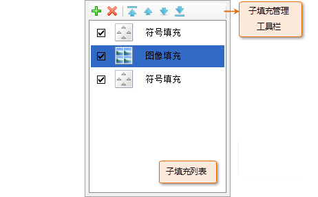
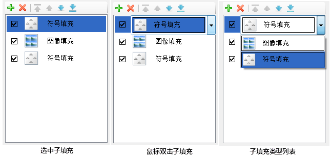

填充符号由一个或多个子填充构成，子填充分为图像填充和符号填充两种类型。填充符号的制作是通过添加子填充，并设置子填充的风格或样式，从而构造出所需要的填充符号。

填充符号编辑器的子填充管理区域，可以对构成填充符号的子填充进行有效的管理，如下图所示。

  

  
当新建一个填充符号时（新建填充符号，参见：[新建填充符号](SymFillManager5.html)），打开填充符号编辑器时，子填充管理区域中的子填充列表中默认添加了一个空的符号填充类型的子填充，需要用户为该符号填充选择符号并设计风格样式，还可以继续添加子填充来逐步进行填充符号的制作；当编辑填充符号库中的已有的填充符号时（编辑填充符号，参见：[编辑填充符号](SymFillManager6.html)），打开填充符号编辑器时，子填充管理区域中的子填充列表将显示构成该填充符号的所有子填充。

子填充列表中的每一项对应一个子填充。

## 添加子填充

在填充符号编辑器中，新建或编辑填充符号时，可以通过单击子填充管理工具栏上的“添加”按钮，来添加一个子填充，默认添加的子填充类型为符号填充。

用户可以在子填充列表中双击新添加的子填充，双击后，该子填充呈现如下（中间图）状态，即变为下拉列表框，单击列表框右侧的下拉按钮，弹出子填充类型列表，可以选择该子填充类型为图像填充或者符号填充。

  

## 删除子填充

    1. 在子填充管理区域中的子填充列表中，选中要删除的子填充，可以配合 Shift 键和 Ctrl 键，同时选中多个子填充；
    2. 单击子填充管理工具栏上的“删除”按钮，删除选中的子填充。注意，子填充一旦删除不可恢复。

## 调整子填充顺序

在子填充管理区域中，子填充列表中的子填充的排列顺序，即为填充符号中相应的子填充的上下叠加顺序；子填充列表中处于最顶端的子填充在填充符号中也处于最顶层；子填充列表中处于最底端的子填充在填充符号中也处于最底层。子填充的叠加顺序可以通过子填充管理工具栏上的按钮来调整子填充在填充符号中的层次顺序。

    1. 在子填充管理区域中的子填充列表中，选中要移动顺序的子填充，可以配合 Shift 键和 Ctrl 键，同时选中多个子填充；
    2. 如果单击子填充管理工具栏上的“”按钮，将选中的子填充移动到最顶端，如果选中的是多个子填充，那么这些子填充一并移动到所有其他子填充的最前面，同时保持选中的子填充间的相对顺序不变。 

如果单击子填充管理工具栏上的“上移”按钮，将选中的子填充向顶端移动一层，即移动到选中子填充的前面一个子填充的前面，如果选中的是多个子填充，那么这些子填充一并向顶端移动一层，同时保持选中的子填充间的相对顺序不变。

如果单击子填充管理工具栏上的“下移”按钮，将选中的子填充向底端移动一层，即移动到选中子填充的后面一个子填充的后面，如果选中的是多个子填充，那么这些子填充一并向底端移动一层，同时保持选中的子填充间的相对顺序不变。

如果单击子填充管理工具栏上的“置底”按钮，将选中的子填充移动到最底端，如果选中的是多个子填充，那么这些子填充一并移动到所有其他子填充的最后面，同时保持选中的子填充间的相对顺序不变。

## 设置子填充类型

填充符号编辑器中提供了两种子填充类型：符号填充和图像填充。在编辑填充符号时，可以随时修改子填充的类型，需要强调的是，一旦改变子填充的类型，就需要为子填充重新指定填充图像或者填充符号。

子填充类型的设置方法与添加子填充时选择填充类型的方法相同：

1. 在子填充管理区域中的子填充列表中，选中要设置子填充类型的某个子填充，然后，在选中的子填充上双击鼠标；
2. 子填充列表中，该选中的子填充变为下拉列表状态，单击右侧的下拉按钮，弹出的下拉列表中列出了可以选择的子填充类型，鼠标左键单击需要的类型，即可将选中的子填充设置为所选类型。

