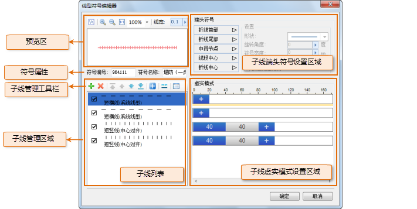

## 线型符号编辑器界面结构

下图展示了线型符号编辑器的界面布局：

* 符号属性：符号属性区域用来设置或修改线型符号的属性，包括：符号编号、符号名称。
* 子线管理区域：子线管理区域用来管理构成线型符号的子线。在制作线型符号时，需要通过新建子线来构造新的线型符号，即线型符号是由若干个子线构成的。子线管理包括：删除、添加子线，移动子线的层次，设置子线的类型和属性等。
* 预览区：实时展现用户所制作和编辑的线型符号的结果，预览区提供了基本的预览操作，可以满足用户的多种预览要求。
* 子线虚实模式设置区域：用来设置子线的虚实模式，获得更为丰富的子线类型。有关子线虚实模式的描述，请参见：[二维线型符号构成](SymLineEditor0.html) 中的 **“子线虚实模式”** 内容。
* 子线端头符号设置区域：用来设置子线的端头符号，有关子线端头符号描述，请参见：[二维线型符号构成](SymLineEditor0.html) 中的 **“子线端头符号”** 内容。

下文介绍了点符号选择器中一小部分功能的使用，关于点符号选择器的其他功能的使用，将在帮助文档中的其他页面进行详细介绍，用户可以查阅帮助文档的其他部分。

  

## 预览区的浏览操作

在线型符号编辑器中的预览区域，预览窗口的上方提供了一系列的功能用来浏览预览窗口内的线型符号，下面具体介绍各个功能的使用。

* “折线”按钮：单击此按钮，可以使预览窗口以折线的形式显示当前所编辑或制作的线型符号，单击此按钮后，预览区中的线型变为折线，同时，该按钮变为：“直线”，此时，单击该按钮，可以使预览窗口以直线的形式显示当前所编辑或制作的线型符号。
* “放大”按钮：单击此按钮，可以放大显示预览窗口所显示的线型符号，单击“放大”按钮一次，可以放大一定倍数，多次单击“放大”按钮可以对预览窗口中的线型符号放大数倍。
* “缩小”按钮：单击此按钮，可以缩小显示预览窗口所显示的线型符号，单击“缩小”按钮一次，可以缩小一定倍数，多次单击“缩小”按钮可以对预览窗口中的线型符号缩小数倍。
* “1:1预览”：单击此按钮，可以对预览窗口中的线型符号以 1：1 的比例进行预览显示。
* **显示比例设置** ：提供了一些预设的数值，控制预览窗口中所显示的线型符号的显示百分比，即对线型符号进行适当比例的放大和缩小。
* **线宽** ：设置预览窗口中所显示的线型符号的显示线宽，如果线型符号中的子线被设置为固定线宽，或者子线由符号构成，那么该显示线宽的设置对这样的子线无效。

