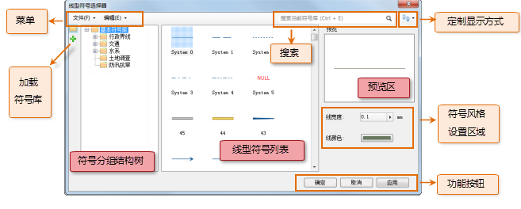

下图展示了线型符号选择器的界面布局：

* 菜单：菜单：菜单中组织了线型符号选择器提供的管理线型符号库的相关功能。 
* 搜索：根据用户输入的符号名称关键字以及符号编号，查找或搜索匹配的符号。 
* 定制显示方式：显示方式的按钮，用来设置符号列表以哪种方式显示其中的符号，包括：以大图标显示符号，以详细信息方式显示符号。
* 符号分组结构树：通过“分组结构”按钮，可以显示或隐藏符号分组结构树。在符号分组结构树中，选择某个符号分组，可以使符号列表中显示该符号分组下的符号内容；符号分组结构树，也是管理符号库的分组结构的场所。有关符号分组的管理，请参见：[符号库分组结构管理](SymMarkerManager3.html)。
* 线型符号列表：线型符号列表用来显示当前符号分组中的所有线型符号。
* 符号风格设置区：对线型符号进行风格设置的区域，包括线型的宽度、颜色。具体设置内容和方法，请参见：[设置线型符号风格](SymLineSelector3.html)。
* 预览区：预览当前对符号所做的风格设置。
* 功能按钮：线型符号选择器下方的功能按钮用来应用或取消当前线型符号风格设置。  

  
