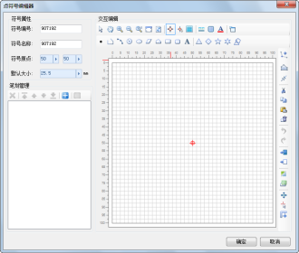

## 点符号编辑器

点符号编辑器，提供了制作新的点符号或者编辑已有的点符号的场所，在点符号编辑器中，用户通过界面交互的方式即可方便、快速、准确地完成点符号的编辑。在点符号编辑器中，只能对矢量点符号进行编辑操作。

  

  
## 如何使用点符号编辑器

下面的表格是将点符号编辑器所提供的功能进行分类，每一部分包含了点符号编辑器的若干项功能点。用户可以使用下面的表格定位所需要了解的功能的使用方法，并且每一部分功能的使用指南都包含了详细的使用步骤以及对操作过程进行录制的图像。

功能分类 | 包含的功能点简介  
---|---  
[打开点符号编辑器](SymMarkerEditor1.html) | 打开点符号编辑器。  
[点符号编辑器界面简介](SymMarkerEditor2.html) | 点符号编辑器的界面结构介绍；符号编辑区域的浏览操作。  
[点符号编辑器环境设置](SymMarkerEditor3.html) |设置点符号编辑器的工作环境，包括：设置符号编辑区域的背景、符号编辑过程中的捕捉设置、符号编辑区域的全屏显示、符号编辑区域刻度尺设置。  
[符号属性设置](SymMarkerEditor4.html) | 设置或者修改符号属性。  
[点符号笔划管理](SymMarkerEditor5.html) | 管理点符号笔划，包括：删除笔划、添加笔划、设置笔划属性、移动笔划层次等操作。  
[点符号笔划绘制](SymMarkerEditor6.html) | 绘制点符号笔划，即绘制构成点符号的各种几何对象，包括：点、线、面几何对象。  
[设置点符号笔划风格](SymMarkerEditor7.html) | 设置点符号笔划风格，分为设置线型笔划风格、点笔划风格和面笔划的边框风格和填充风格。  
[点符号笔划编辑](SymMarkerEditor8.html) |点符号笔划编辑，包括:笔划的删除、笔划的复制与粘贴、编辑操作的撤销与恢复、笔划节点编辑、笔划布局（对齐）、笔划旋转、笔划变换（镜像与翻转）。  
[点符号笔划几何计算](SymMarkerEditor9.html) | 点符号笔划几何计算，包括：笔划间的裁剪运算操作、合并运算操作，画线分割操作。  
[点符号笔划转换](SymMarkerEditor10.html) | 点符号笔划转换，即将线条转换为面域，或者将面对象转化为线条。  
[保存符号编辑成果](SymMarkerEditor11.html) | 保存符号编辑成果。  
  
