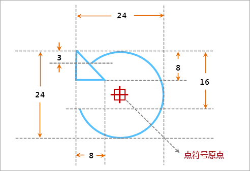

## 点符号描述

本操作演示为制作下图所示的点符号，下图标注了点符号的规格尺寸，该点符号都是由线条组成，主要包括一条弧线和一个等腰直角三角形线宽两部分。

  

  
## 制作方案

根据上面的点符号设计图，简单梳理下该点符号制作的基本思路，可以便于理解下面的演示录像。

1. 绘制一个半径为12的圆弧线，由于只提供了绘制圆面，因此，需要将所绘制的圆面转换为线，即可获得需要的圆弧线。
2. 擦除圆弧线上不需要的部分。
3. 绘制直角边长度为8的等腰直角三角形，并摆放到合适的位置。

操作演示

