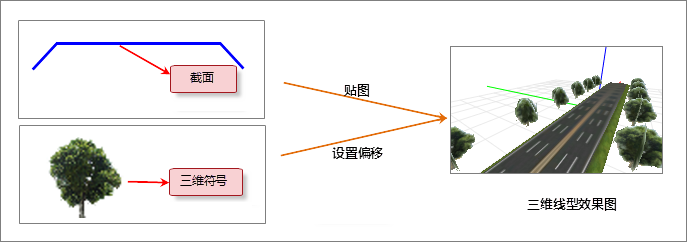

## 三维线型符号符号描述

本操作演示为制作下图所示的三维线型符号，该三维线型符号由一个截面子线和两个模型子线构成，通过设置截面子线的贴图、模型子线中模型的偏移量，达到如下图所示的三维线型符号效果。

  

  
## 制作方案

根据上面的三维线型符号设计图，简单梳理下该三维线型符号制作的基本思路，可以便于理解下面的演示录像。

1. 新建三维线型符号后，系统自动添加一个截面子线，绘制道路形状的截面，并分别为路面和路牙进行贴图。
2. 添加一个模型子线，导入树状的三维符号，并设置其偏移量。
3. 再添加一个模型子线，并选择与上一步相同的三维符号，并相应地设置偏移量，使树木位于道路的另一旁。
4. 在预览窗口上通过鼠标或键盘操作调整视点，调整到满意的效果后，设置快照。

操作演示

  
