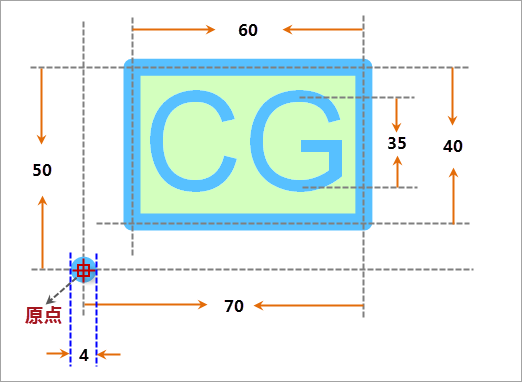

## 点符号描述

本操作演示为制作下图所示的点符号，下图标注了点符号的规格尺寸，该点符号是由一个矩形、一个文本和一个圆三部分组成。

  

## 制作方案

根据上面的点符号设计图，简单梳理下该点符号制作的基本思路，可以便于理解下面的演示录像。

1. 绘制一个矩形面对象，设置该矩形面对象的边框和填充风格。
2. 绘制一个文本对象，设置文本对象的文字高度。
3. 绘制一个指定半径的圆面，设置其风格。

操作演示

