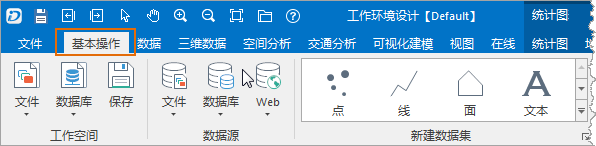
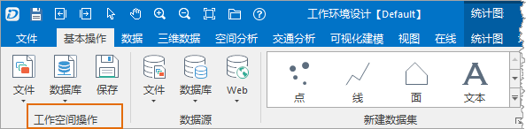
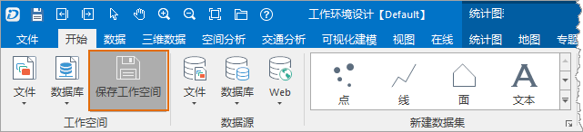

下面通过以下几处定制来了解功能区界面元素的定制：

* 修改功能区上“开始”选项卡的选项卡名称为“基本操作”；
* 修改“开始”选项卡中的“工作空间”组的显示名称为“工作环境相关操作”；
* 修改“开始”选项卡的“工作空间”组中的保存按钮的显示名称为“保存工作空间”，显示图标为D:\Data\SaveWS.png 图片文件。

### 修改选项卡名称：

1. 在工作环境设计窗口的结构区中找到并选中功能区中的“开始”选项卡对应的结点；
2. 在属性浏览设置区，修改“开始”选项卡的名称，属性“标签”用来设置选项卡的名称，将该属性值修改为“基本操作”；
3. 修改后，可以在预览区域看到修改后的效果；  
下图为修改“开始”选项卡的名称后的效果：
  
 
4. 如果确定保存修改的结果，点击工作环境设计窗口中的“确定”按钮，关闭工作环境设计窗口并应用修改的设置。

### 修改选项卡中组的显示名称：

1. 在工作环境设计窗口的结构区中找到并选中功能区中“开始”选项卡中的“工作空间”组对应的结点；
2. 在属性浏览设置区，修改“工作空间”组的显示名称，属性“标签”用来设置组的显示名称，将该属性值修改为“工作空间操作”；
3. 修改后，可以在预览区域看到修改后的效果；  
下图为修改“工作空间”组的显示名称后的效果
  
 
4. 如果确定保存修改的结果，点击工作环境设计窗口中的“确定”按钮，关闭工作环境设计窗口并应用修改的设置。

### 定制功能区中的控件

1. 在工作环境设计窗口的结构区中找到并选中功能区“开始”选项卡 “工作空间”组中的“保存”按钮控件对应的结点，也可在预览区直接选中“保存”按钮控件；
2. 在属性浏览设置区，修改“保存”按钮控件的显示名称，属性“标签”用来设置控件的显示名称，将该属性值修改为“保存工作空间”；
3. 修改控件的显示图标，属性“图片”用来设置控件的显示图标，该属性值为图标文件的路径，可以为相对路径，也可以为绝对路径，用户可以在此输入新图标 文件的路径（D:\Data\SaveWS.png）；也可以点击该属性值单元格，点击单元格右侧出现的小按钮，通过“打开”对话框来定位和选择图标文件。
4. 修改后，可以在预览区域看到修改后的效果；  
下图为修改“保存”按钮控件后的效果 ： 

  

5. 如果确定保存修改的结果，点击工作环境设计窗口中的“确定”按钮，关闭工作环境设计窗口并应用修改的设置。
