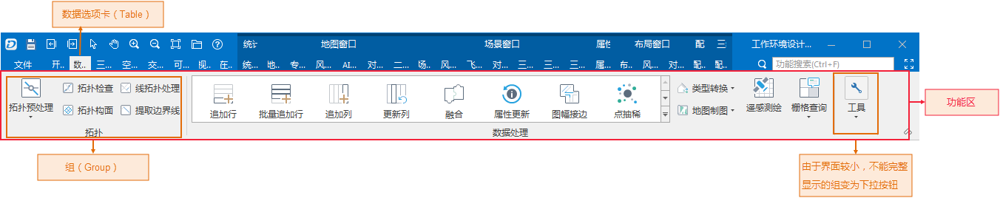
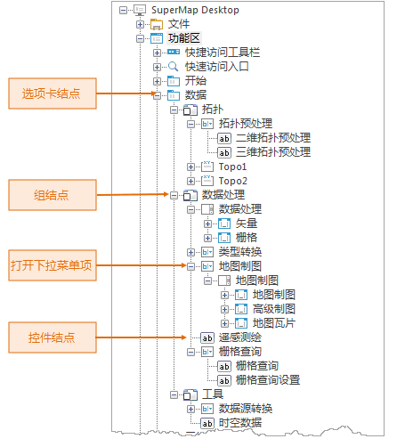

工作环境设计窗口中的功能区是应用程序界面中的功能区的完成呈现，应用程序中构建的所有选项卡都呈现在定制窗口中预览区中的功能区中，如下图所示。

当定制窗口比较小时，功能区所有选项卡的名称并列显示不下时，功能区选项卡名称一行的左右两侧会出现左右箭头，点击箭头即可实现该行的滚动，
从而显示被遮盖的选项卡名称；另外，当定制窗口较小时，如果某个选项卡中的内容不能并列显示时，该选项卡中的某些组会变为下拉按钮，通过点击下拉按钮，来呈现该组的完整内容。

功能区（Ribbon）是承载具有一定功能的控件的区域，功能区采用选项卡（tab 页）和组（group 组）的组织结构来组织和管理功能区上的所有功能控件。

  

* 图中红色矩形框所示的区域为功能区，即功能控件放置的区域。功能区所放置的各个控件统称为 Ribbon 控件，功能区上只能放置 Ribbon 控件。 
* 功能区最顶部所显示的名称，如“开始”、“数据”、“视图”等，为相应的选项卡的名称，通过点击选项卡的名称，即可进入相应的选项卡页。 选项卡是功能区组织控件的一种形式，用以将功能类似的控件组织在一起，上图所示的“开始”选项卡为当前被选中的选项卡，此时，功能区上所呈现的控件为组织在“开始”选项卡中的功能控件。
* 图中类似于橘黄色矩形框所示的组织为组（group），组是对一个选项卡中的控件进一步细化和归类的组织形式。组的最底部所显示的名称为该组的名称， 组的名称同时体现了包含在该组中的控件所绑定的功能，例如“工作空间”组所包含的功能与工作空间操作相关。
* 有些组（group 组）会绑定对话框，当某个组绑定了对话框时，该组的最右下角会出现一个特殊的小按钮， 称为弹出组对话框按钮，点击该按钮会弹出对话框，用以辅助相关功能的设置。

在工作环境设计窗口的结构区中，根结点下显示名称为“功能区”的子结点对应预览区中的功能区，功能区结点的子结点对应着应用程序包含的所有选项卡，
选项卡结点的子结点对应着该选项卡所包含的组，组结点的子结点就对应着该组包含的控件。功能区中的界面元素与结构区中结点的对应关系都为一一对应的关系。

另外，组中可以包含另一个组织，称为控件盒（box），可以将组中的控件进一步分组，因此，含有这种控件盒组织的组对应结构区中的结点的子结点为控件盒结点，
控件盒结点的子结点对应控件盒中的控件。

结构区中对应功能区上的界面元素（选项卡、组、控件等）的结点，其结点的显示名称为该界面元素在界面上所显示的名称。

  
